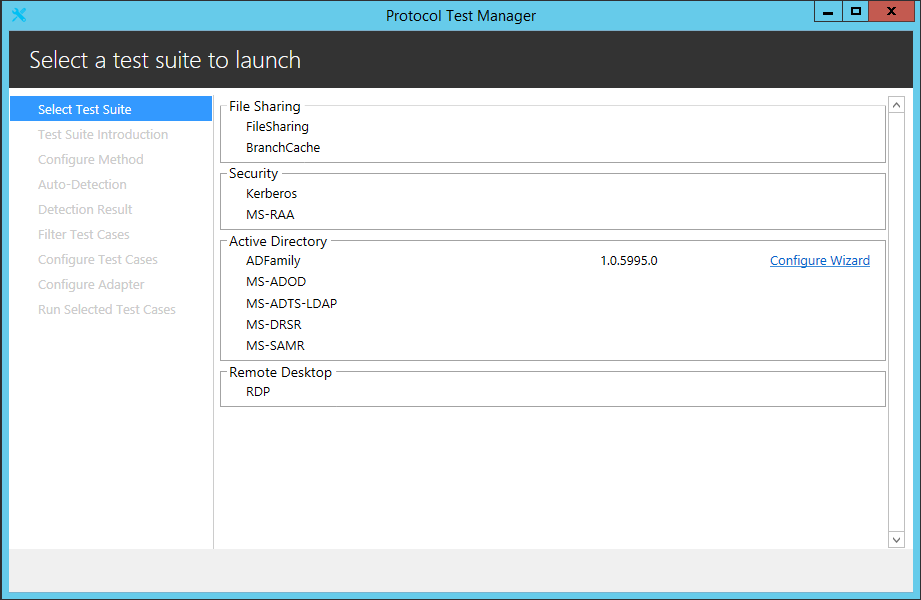
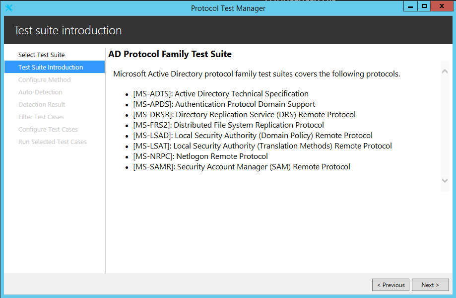
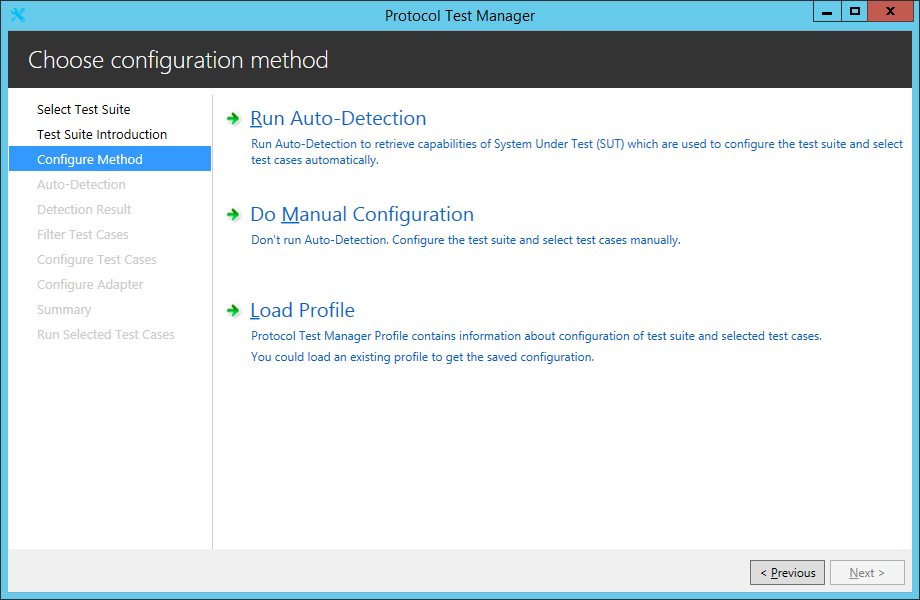
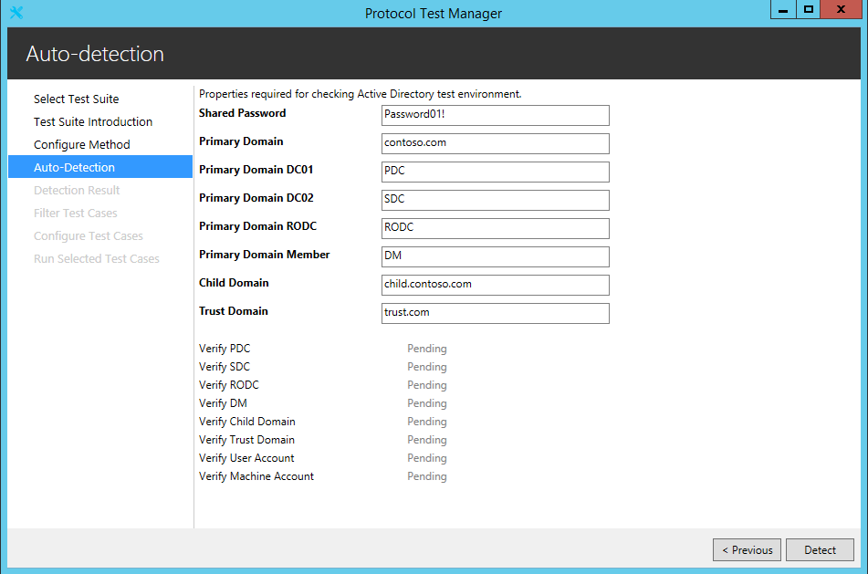
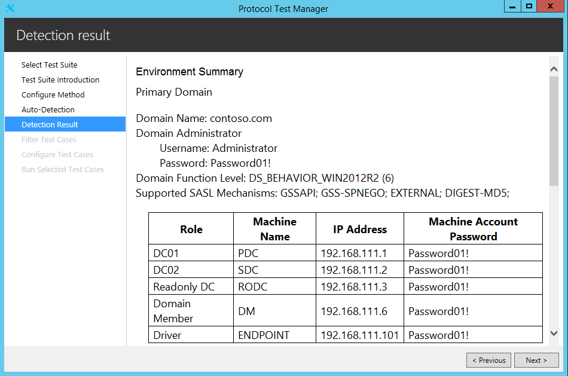
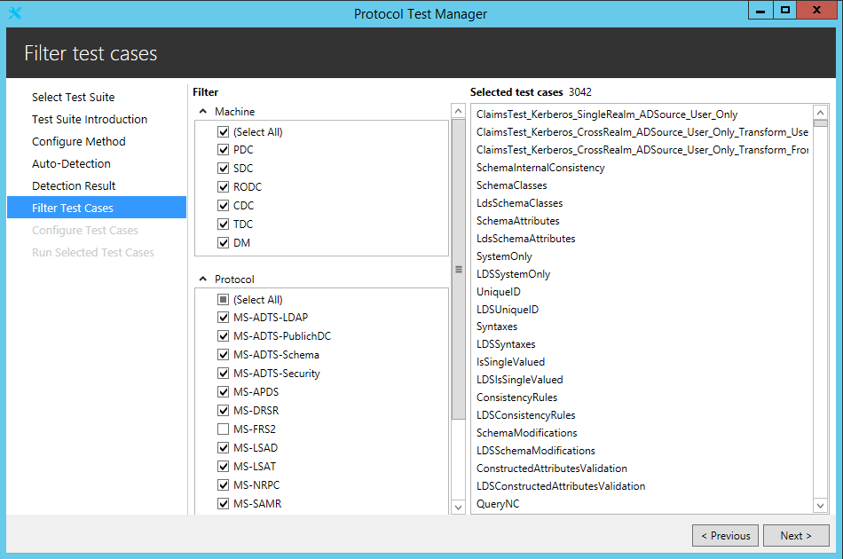
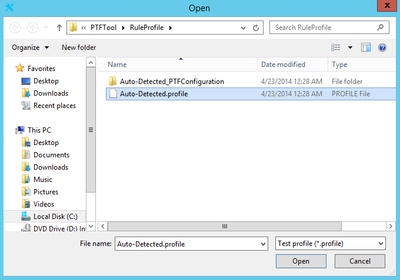
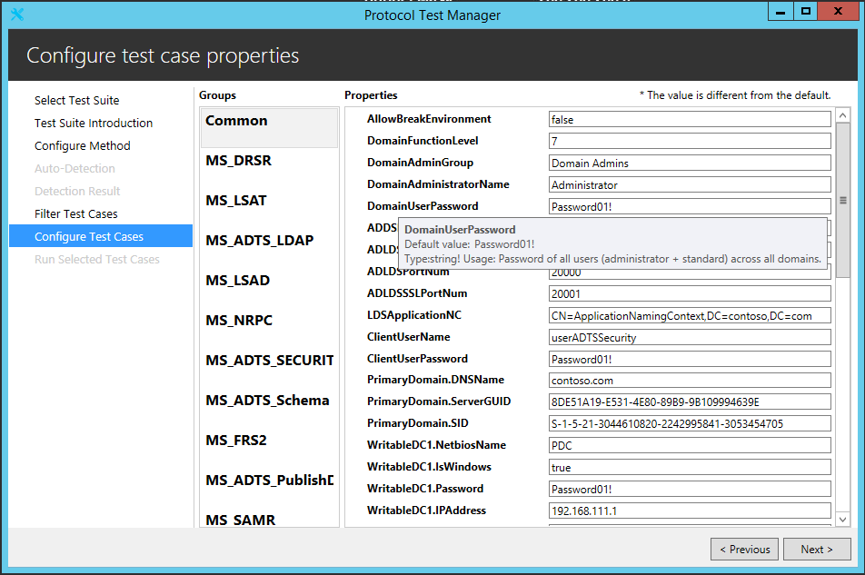
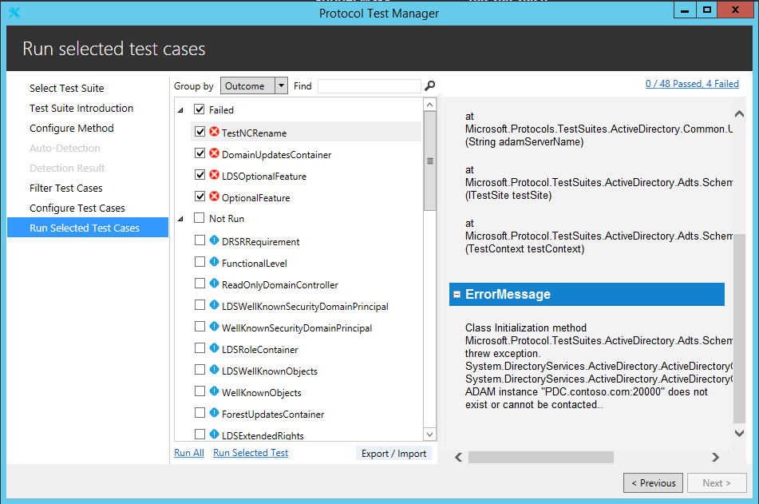
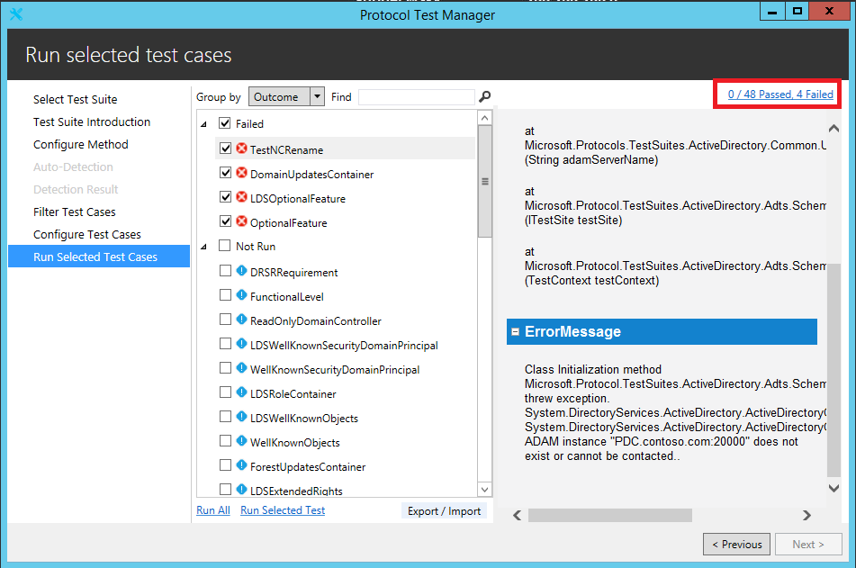

# Active Directory Protocol Family Server Test Suite User Guide 

## Contents

* [Introduction](#_Toc426644909)
* [License Information](#_Toc426644910)
* [Further Assistance](#_Toc426644911)
* [Quick Start Checklist](#_Toc426644912)
* [Requirements](#_Toc426644913)
    * [Network Infrastructure](#_Toc426644914)
    * [Environment](#_Toc426644915)
    * [Driver Computer](#_Toc426644916)
    * [Domain Controller (Primary DC, Secondary DC, Read-Only DC, Child DC, Trusted DC)](#_Toc426644917)
    * [Domain Member Server (DM)](#_Toc426644918)
    * [Software](#_Toc426644919)
* [Network Setup](#_Toc426644920)
    * [Domain Environment](#_Toc426644921)
    * [Verify Connectivity from the Driver Computer](#_Toc426644922)
* [Computer Setup](#_Toc426644923)
    * [Domain Environment](#_Toc426644924)
		* [Set up the Primary Domain Controller (PDC)](#_Toc426644925)
		* [Set up the Secondary Domain Controller (SDC)](#_Toc426644926)
		* [Set up the Read Only Domain Controller (RODC)](#_Toc426644927)
		* [Set up the Child Domain Controller (CDC)](#_Toc426644928)
		* [Set up the Trusted Domain Controller (TDC)](#_Toc426644929)
		* [Set up the Domain Member](#_Toc426644930)
		* [Set up the Driver Computer](#_Toc426644931)
    * [Computer Setup for Windows platform](#_Toc426644932)
		* [Install DNS Service and Active Directory Domain Services with a Specific Domain](#_Toc426644933)
		* [Turn off Firewall](#_Toc426644934)
		* [Set Computer Password](#_Toc426644935)
		* [Configure the Netlogon Service to Depend on the DNS Service](#_Toc426644936)
		* [Set Machine Account Privilege](#_Toc426644937)
		* [Install Active Directory Certificate Services](#_Toc426644938)
		* [Install Active Directory Lightweight Directory Services](#_Toc426644939)
		* [Install DFS Management Tools](#_Toc426644940)
		* [Set DFS Replication Debug Log Level to 5 (MAX)](#_Toc426644941)
		* [Install IIS](#_Toc426644942)
		* [Create Local Admin User Account](#_Toc426644943)
		* [Create a Local Non-Admin User Account](#_Toc426644944)
		* [Add a Local Non-Admin User Account to a Group](#_Toc426644945)
		* [Set UPN for AD User](#_Toc426644946)
		* [Enable Optional Feature](#_Toc426644947)
		* [Replicate from PDC on SDC](#_Toc426644948)
		* [Set Security Level](#_Toc426644949)
		* [Install CA Certificate](#_Toc426644950)
		* [Export SSL certificate](#_Toc426644951)
		* [Configure SSL Binding for IIS Website](#_Toc426644952)
* [Installed Files and Folders](#_Toc426644953)
* [Configuration](#_Toc426644954)
    * [Configuring the Test Suite](#_Toc426644955)
		* [Protocol Test Manager](#_Toc426644956)
* [Running Test Cases](#_Toc426644957)
    * [Run Test Cases by Specific Protocol](#_Toc426644958)
    * [Run All Test Cases](#_Toc426644959)
    * [Run Test Cases by Category](#_Toc426644960)
    * [Check Test Results](#_Toc426644961)
* [Debugging Test Cases](#_Toc426644962)
* [Using Protocol Test Manager](#_Toc426644963)

## <a name="_Toc426644909"/>Introduction

This guide provides information about how to install, configure, and run Active Directory Family Test Suite in its environment. This suite is designed to test implementations of active directory protocol family protocols including Active Directory Schema Attributes, Active Directory Lightweight Directory Services Schema, Active Directory Schema Classes, Active Directory Technical Specification, Authentication Protocol Domain Support, Directory Replication Server (DRS) Remote Protocol, Distributed File System Replication Protocol, Local Security Authority (Domain Policy) Remote Protocol, Local Security Authority (Translation Methods) Remote Protocol, Netlogon Remote Protocol, Security Account Manager (SAM) Remote Protocol (Client-to-Server), as specified in the Microsoft document _[MS-ADA1], [MS-ADA2], [MS-ADA3], [MS-ADLS], [MS-ADSC],_ _[MS-ADTS], [MS-APDS], [MS-DRSR] , [MS-FRS2], [MS-LSAD], [MS-LSAT], [MS-NRPC], and [MS-SAMR]._ This guide provides information about using this test suite on the Microsoft® Windows® operating system and on operating systems that are not Windows based. 

This suite tests only the protocol implementation behaviors that are observed on the wire. For detailed information about the design of this test suite, see _ADFamily_ServerTestDesignSpecification.docx_.

## <a name="_Toc426644910"/>License Information

For licensing information, see the End User License Agreement (EULA) that was provided with this test suite. The EULA is contained in the License.rtf file in the installation folder.

## <a name="_Toc426644911"/>Further Assistance

If you need further information about this test suite or assistance in troubleshooting issues related to this test suite, contact [dochelp@microsoft.com](mailto:dochelp@microsoft.com).

## <a name="_Toc426644912"/>Quick Start Checklist

The following checklist summarizes the steps you need to complete to get the test suite up and running. The checklist also provides references to documentation that can help you get started.

|  **Check**|  **Task**|  **Topic**| 
| -------------| -------------| ------------- |
| □| Download the test suite for the protocol implementation| For a list of the files that the download package contains, see section [8](#_Toc426644953).| 
| □| Confirm that your test environment and computers meet the requirements of the test suite| For information about the requirements of the test suite, see section [5](#_Toc426644913). | 
| □| Set up the Primary Domain Controller (DC)| See section [7.1.1](#_Toc426644925).| 
| □| Set up the Secondary Domain Controller (SDC)| See section [7.1.2](#_Toc426644926).| 
| □| Set up the Read Only Domain Controller (RODC)| See section [7.1.3](#_Toc426644927).| 
| □| Set up the Child Domain Controller (CDC)| See section [7.1.4](#_Toc426644928).| 
| □| Set up the Trust Domain Controller (TDC)| See section [7.1.5](#_Toc426644929).| 
| □| Set up the Domain Member (DM)| See section [7.1.6](#_Toc426644930).| 
| □| Set up the Driver Computer (ENDPOINT)| See section [7.1.7](#_Toc426644931).| 
| □| Set up the network| See section [6](#_Toc426644920).| 
| □| Verify the connections from the driver computer to the DCs and other computers| See section [6.2](#_Toc426644922).| 
| □| Install the software prerequisites| For information about software that must be installed on the computers in your test environment before the test suite can be run, see section [5.6](#_Toc426644919).| 
| □| Configure the test suite settings| See section [9.1](#_Toc426644955).| 
| □| Run test cases by specific protocol| Section [10.1](#_Toc426644958).| 
| □| Run all test cases| Section [10.2](#_Toc426644959).| 
| □| Run test cases by category| Section [10.3](#_Toc426644960).| 
| □| Debug test cases| Section [11](#_Toc426644962).| 
| □| Check test results| Section [10.4](#_Toc426644961).| 

## <a name="_Toc426644913"/>Requirements 
This section describes the requirements for the test environment that is used to run this test suite.

### <a name="_Toc426644914"/>Network Infrastructure

* A test network is required to connect the test computer systems.

* It must consist of an isolated hub or switch.

* It must not be connected to a production network or used for any other business or personal communications or operations.

* It must not be connected to the internet.

* IP addresses must be assigned for a test network.

* Computer names should be assigned in a test network infrastructure.

* User credentials used on the system must be dedicated to the test network infrastructure.

* Details including computer IP addresses, names and credentials are saved in log files.

Refer to the Privacy Statement and EULA for further information.

### <a name="_Toc426644915"/>Environment

Run this test suite in a domain environment that contains the following computers (physical or virtual): 

* A driver computer running Microsoft® Windows 8.1 Enterprise or Microsoft® Windows Server® 2012 R2

* Five computers set up as Domain Controllers (DCs) - 3 in the primary domain (Primary DC, Secondary DC, and Read-Only DC), 1 in the child domain (Child DC), and 1 in the trusted domain (Trusted DC) - running Microsoft® Windows Server® 2012 R2, or computers set up as domain controllers that are not based on the Windows operating system service. 

* A computer setup as Domain Member (DM) running Microsoft® Windows Server® 2012 R2 or a computer set up as DM that is not based on the Windows operating system service.

### <a name="_Toc426644916"/>Driver Computer 

The minimum requirements for the driver computer are as follows. 

|  **Requirement**|  **Description**| 
| -------------| ------------- |
| Operating system| Microsoft Windows 8.1, Enterprise Edition| 
| Memory| 2 GB RAM| 
| Disk space| 60 GB | 

### <a name="_Toc426644917"/>Domain Controller (Primary DC, Secondary DC, Read-Only DC, Child DC, Trusted DC)

The minimum requirements for the DC are as follows.

|  **Requirement**|  **Description**| 
| -------------| ------------- |
| Operating system| For Windows platform: Microsoft Windows Server 2012 R2, Standard Edition, or a DC implementation that is not based on the Windows operating system| 
| Services| For Windows platform: Active Directory Domain Services (AD DS)| 
| Memory| 1 GB RAM| 
| Disk space| 60 GB| 

### <a name="_Toc426644918"/>Domain Member Server (DM)
The minimum requirements for a domain member.

|  **Requirement**|  **Description**| 
| -------------| ------------- |
| Operating system| Microsoft Windows Server 2012 R2, Standard Edition, or a server that is not based on the Windows operating system| 
| Memory| 1 GB RAM| 
| Disk space| 60 GB| 

### <a name="_Toc426644919"/>Software 
All of the following software must be installed on the driver computer ***before*** the installation of this test suite. 

|  **Required Software** | 
| ------------- |
| **Microsoft® Visual Studio® 2012**| 
|      Note| 
|            You can download Visual Studio Ultimate 2012 Trial (30 days) from below website| 
|            [http://www.microsoft.com/en-us/download/details.aspx?id=30678](http://www.microsoft.com/en-us/download/details.aspx?id=30678)| 
|            You can download Visual Studio 2012 Update 4 or later from below website| 
|            [http://www.microsoft.com/en-us/download/confirmation.aspx?id=39305](http://www.microsoft.com/en-us/download/confirmation.aspx?id=39305)| 
| **Spec Explorer** (build 3.5.3146.0 or later)| 
| Spec Explorer is a model based testing tool used by test suite to design model and generate test cases.| 
|      Note| 
|            You can download Spec Explorer from below website| 
|            [http://visualstudiogallery.msdn.microsoft.com/271d0904-f178-4ce9-956b-d9bfa4902745/](http://visualstudiogallery.msdn.microsoft.com/271d0904-f178-4ce9-956b-d9bfa4902745/)| 
| **Microsoft Protocol Test Framework**| 
| Microsoft Protocol Test Framework is a common framework to support protocol test suite. | 
|      Note| 
|            You can download Microsoft protocol Test Framework from below website| 
|            [https://github.com/microsoft/protocoltestframework](https://github.com/microsoft/protocoltestframework) | 
| **Windows PowerShell 3.0** is required.| 
| **Protocol Test Manager**| 
| Protocol Test Manager provides a graphical UI for easily configuring and running Microsoft Windows Protocol Test Suites.| 
| **Microsoft Message Analyzer**| 
|        Note| 
|              You can download the latest Message Analyzer (MA) from below website. We need to install MA so that our test cases will call MA library to do live capture and verification of the network trace. It’s all automatic process, so users will only need to install the latest version of MA first. | 
|              [http://www.microsoft.com/en-us/download/details.aspx?id=44226](http://www.microsoft.com/en-us/download/details.aspx?id=44226)           | 
|  **Optional Software** | 
|  | 

## <a name="_Toc426644920"/>Network Setup

Run this test suite in a domain environment using either physical or virtual machines. This section describes the test environment using physical computers. 

For information about configuring a virtual machine, see [http://www.microsoft.com/virtualization/en/us/solution-appliance-test.aspx](http://www.microsoft.com/virtualization/en/us/solution-appliance-test.aspx). The configuration of virtual machines for use with this test suite is out of the scope of this guide. 

### <a name="_Toc426644921"/>Domain Environment

The domain environment requires interactions between the following computers and server roles. 

* The driver computer runs the test cases and request messages over the Ethernet.

* The SUT (every DC) runs an implementation of the protocol that is being tested. The SUT responds to the requests that the driver computer sends.

* Any additional computer and server role is specified to provide functionality that is required to test the protocol implementation.

The following figure shows the domain environment and the recommended network configurations.

| &#32;| &#32;| &#32;| &#32;| &#32;| &#32; |
| -------------| -------------| -------------| -------------| -------------| ------------- |
| Machine Name/Access Point| NIC| IPv4| Subnet Mask| Default Gateway| DNS Server| 
| PDC| External1| 192.168.111.1| 255.255.255.0| 192.168.111.1| 192.168.111.1 192.168.111.2| 
| | | | | | 192.168.111.5| 
| SDC| External1| 192.168.111.2| 255.255.255.0| 192.168.111.1| 192.168.111.1| 
| RODC| External1| 192.168.111.3| 255.255.255.0| 192.168.111.1| 192.168.111.1| 
| CDC| External1| 192.168.111.4| 255.255.255.0| 192.168.111.1| 192.168.111.1| 
| TDC| External1| 192.168.111.5| 255.255.255.0| 192.168.111.1| 192.168.111.1| 
| | | | | | 192.168.111.5| 
| DM| External1| 192.168.111.6| 255.255.255.0| 192.168.111.1| 192.168.111.1| 
| ENDPOINT| External1| 192.168.111.101| 255.255.255.0| 192.168.111.1| 192.168.111.1| 
| | | | | | 192.168.111.4| 
| | | | | | 192.168.111.5| 

### <a name="_Toc426644922"/>Verify Connectivity from the Driver Computer

After you set up the environment, please verify the network connectivity from the driver computer to the servers in the test environment.

## <a name="_Toc426644923"/>Computer Setup 

This section is about how to set up a Windows-based the test environment.

### <a name="_Toc426644924"/> Domain Environment

#### <a name="_Toc426644925"/>Set up the Primary Domain Controller (PDC)

* Log on to the PDC computer as local administrator;

* Install the ADFamily_ServerTestSuite.msi, and choose **“Install and configure Windows System Under Test (SUT)”** in the “Select the endpoint you are installing on” page;

* Go to C:\MicrosoftProtocolTests\ADFamily\Server-Endpoint\ &#60; version &#35;  &#62; \Scripts, and open the ADFamily.xml file;

* Find the element “/lab/server/vm” which has property “hypervname==AD_PDC”, and then edit the properties as shown in the following table:

|  **Property**|  **Description**| 
| -------------| ------------- |
|  **name**| The computer name of the PDC.| 
| | The default value is “PDC”.| 
|  **domain**| The FQDN of the domain name of the PDC.| 
| | The default value is “contoso.com”.| 
|  **username**| The domain administrator account that is used to log on to the PDC.| 
| | The default value is "Administrator".| 
|  **password**| The password that is used to log on to the domain administrator account.| 
| | The default value is "Password01!".| 
|  **ip**| The IP Address of the PDC.| 
| | The default value is "192.168.111.1".| 
|  **subnet**| The subnet of the PDC.| 
| | The default value is "255.255.255.0”.| 
|  **gateway**| The gateway of the PDC.| 
| | The default value is “192.168.111.1”| 
|  **dns**| The DNS of the PDC.| 
| | The default value is “192.168.111.2;192.168.111.1;192.168.111.5”.| 
|  **ldsinstancename**| The AD LDS instance name.| 
| | The default value is “instance01”.| 
|  **ldsldapport**| The LDAP port number for the AD LDS instance.| 
| | The default value is “20000”.| 
| | Note | 
| | This port must be reserved for ADLDS and not used by any other process.| 
|  **ldssslport**| The SSL port number for the AD LDS instance.| 
| | The default value is "20001".| 
|  **ldsnewapplicationpartitiontocreate**| The new application partition to be created for the AD LDS instance.| 
| | The default value is "CN=ApplicationNamingContext".| 
|  **ldsserviceaccount**| The LDS service account for the PDC.| 
| | The default value is "CONTOSO\Administrator".| 
|  **ldsservicepassword**| The LDS service account password.| 
| | The default value is “Password01!”.| 
|  **ldsadministrator**| The administrator for the LDS instance.| 
| | The default value is “CONTOSO\Administrator”.| 
|  **ldssourceusername**| The username for the LDS source user.| 
| | The default value is “CONTOSO\Administrator”.| 
|  **ldssourcepassword**| The password for the LDS source user.| 
| | The default value is “Password01!”.| 
|  **clientname**| The client computer’s hostname.| 
| | The default value is “ENDPOINT”.| 
|  **clientuser**| The username for the default test user.| 
| | The default value is “userADTSSecurity”.| 
|  **userpassword**| The password for the default test user.| 
| | The default value is “Password01!”.| 
|  **CAroot**| The name of the Root Certificate Authority.| 
| | The default value is “EnterpriseRootCA”.| 
|  **trusttargetdomain**| The domain name of the trusted target domain.| 
| | The default value is “trust.com”.| 
|  **trustpassword**| The trust password of the trusted target domain.| 
| | The default value is “Password01!”.| 

Note 

>Please rename ADFamily.xml to Protocol.xml under folder "C:\MicrosoftProtocolTests\ADFamily\Server-Endpoint\Scripts" before running following PowerShell scripts.

* Start Windows PowerShell by right-click on the **Windows PowerShell** icon, and then click **Run as Administrator**, or type following command in a Windows PowerShell command window, and then press **Enter**:
Start-process powershell -verb runAs

* At the command prompt, type the following command, and then press **Enter**:

* Set-ExecutionPolicy Unrestricted –F

* Type cd C:\MicrosoftProtocolTests\ ADFamily\Server-Endpoint\ _&#60; version &#35;  &#62;_ \Scripts, and press **Enter**.

* Type .\Config-PDC.ps1, and press **Enter**.

The actual steps of the Config-PDC.ps1 script are as the following. So if you are configuring a non-Windows environment, you could also follow the steps below:

#####Configure IP addresses and set the computer name
Set the IP addresses and computer name according to the table in section [6.1](#_Toc426644921).

For Windows platform, refer to [http://windows.microsoft.com/en-us/windows/change-tcp-ip-settings &#35; 1TC=windows-7](http://windows.microsoft.com/en-us/windows/change-tcp-ip-settings) about “How to Configure IP Addresses” and refer to [http://windows.microsoft.com/en-us/windows/change-computer-name &#35; 1TC=windows-7](http://windows.microsoft.com/en-us/windows/change-computer-name) about “How to Configure Computer Name”.

#####Turn off UAC
For Windows platform, refer to [http://windows.microsoft.com/en-us/windows/turn-user-account-control-on-off &#35; 1TC=windows-7](http://windows.microsoft.com/en-us/windows/turn-user-account-control-on-off) about “How to Turn On/Off UAC”.

#####Promote DC
Promote the computer to be a Domain Controller.
For Windows platform, refer to section [7.2.1](#_Toc426644933).

#####Turn off Firewall
For Windows platform, refer to section [7.2.2](#_Toc426644934).

#####Set Computer Password
For Windows platform, refer to section [7.2.3](#_Toc426644935).

#####Configure the Netlogon Service to Depend on the DNS Service
For Windows platform, refer to section [7.2.4](#_Toc426644936).

#####Set Machine Account Privilege
For Windows platform, refer to section [7.2.5](#_Toc426644937).

#####Install Active Directory Certificate Services
For Windows platform, refer to section [7.2.6](#_Toc426644938).

#####Install Active Directory Lightweight Directory Services
For Windows platform, refer to section [7.2.7](#_Toc426644938_1).

#####Install DFS Management Tools
For Windows platform, refer to section [7.2.8](#_Toc426644940).

#####Set DFS Replication Debug Log Level to 5
For Windows platform, refer to section [7.2.9](#_Toc426644941).

#####Install IIS
For Windows platform, refer to section [7.2.10](#_Toc426644942).

#####Create client user for AD LDS instance
For Windows platform, refer to section [7.2.12](#_Toc426644944).

#####Add client user to “Domain Admins”, “Domain Users”, “Enterprise Admins”, “Schema Admins”, and “Group Policy Creator Owners” groups
For Windows platform, refer to section [7.2.13](#_Toc426644945).

#####Set UPN for Client User
For Windows platform, refer to section [7.2.14](#_Toc426644946).

#####Install AD LDS Instance under Client User
For Windows platform, refer to [https://technet.microsoft.com/en-us/library/cc816778(v=ws.10).aspx](https://technet.microsoft.com/en-us/library/cc816778(v=ws.10).aspx). Also import all available LDIF files.

#####Enable Optional Feature
For Windows platform, refer to section [7.2.15](#_Toc426644947).

#####Other Settings in AD DS
Set attribute “msDS-Other-Settings” on object “CN=Directory Service, CN=Windows NT, CN=Services, CN=Configuration,  &#60; DomainNC &#62; ”, and add “ADAMAllowADAMSecurityPrincipalsInConfigPartition=1” to the original value.

Set attribute “msDS-Behavior-Version” on object “CN=Partitions, CN=Configuration,  &#60; DomainNC &#62; ” to the expected value under testing.

Set attribute “msDS-AdditionalDnsHostName” on DC computer object to “ &#60; hostname &#62; . &#60; domain name &#62; ”.

#####Other Settings in AD LDS
Set attribute “msDS-Other-Settings” on object “CN=Directory Service, CN=Windows NT, CN=Services, CN=Configuration,  &#60; ADAMDomainDN &#62; ”, and add “ADAMAllowADAMSecurityPrincipalsInConfigPartition=1” to the original value.

#####Update msDS-AdditionalDnsHostName of the driver computer object
This setting should be conducted after the configuration of the driver computer.
Set the msDS-AdditionalDnsHostName attribute of the driver computer object to be “ &#60; driver hostname &#62; . &#60; domain name &#62; ”.

#####Export SSL certificate and Configure SSL Binding for IIS WebSite
This setting should be conducted after the configuration of the driver computer.
For Windows platform, refer to section [7.2.19](#_Toc426644951), [7.2.20](#_Toc426644952). 

#### <a name="_Toc426644926"/>Set up the Secondary Domain Controller (SDC)
This section provides information about how to setup a Windows-based SDC for use with this test suite.

* Log on to the SDC computer as local administrator;

* Install the ADFamily_ServerTestSuite.msi, and choose **“Install and configure Windows System Under Test (SUT)”** in the “Select the endpoint you are installing on” page;

* Go to C:\MicrosoftProtocolTests\ADFamily\Server-Endpoint\ &#60; version &#35;  &#62; \Scripts, and open the ADFamily.xml file;

* Find the element “/lab/server/vm” which has property “hypervname==AD_SDC”, and then edit the properties as shown in the following table:

|  **Property**|  **Description**| 
| -------------| ------------- |
|  **name**| The computer name of the SDC.| 
| | The default value is “SDC”.| 
|  **domain**| The FQDN of the domain name of the PDC.| 
| | The default value is “contoso.com”.| 
|  **username**| The domain administrator account that is used to log on to the RODC.| 
| | The default value is "Administrator".| 
|  **password**| The password that is used to log on to the domain administrator account.| 
| | The default value is "Password01!".| 
|  **ip**| The IP Address of the SDC.| 
| | The default value is "192.168.111.2".| 
|  **subnet**| The subnet of the SDC.| 
| | The default value is "255.255.255.0”.| 
|  **gateway**| The gateway of the SDC.| 
| | The default value is “192.168.111.1”| 
|  **dns**| The DNS of the SDC.| 
| | The default value is “192.168.111.1”.| 
|  **replicasourcedc**| The replication source DC for the SDC.| 
| | The default value is “PDC.contoso.com”| 

* Start Windows PowerShell by right-click on the **Windows PowerShell** icon, and then click **Run as Administrator**, or type following command in a Windows PowerShell command window, and then press **Enter**:
Start-process powershell -verb runAs

* At the command prompt, type the following command, and then press **Enter**:

* Set-ExecutionPolicy Unrestricted –F

* Type cd C:\MicrosoftProtocolTests\ ADFamily\Server-Endpoint\ _&#60; version &#35;  &#62;_ \Scripts, and press **Enter**.

* Type .\Config-SDC.ps1, and press **Enter**.

The actual steps of the Config-SDC.ps1 script are as the following:

#####Configure IP addresses and set the computer name to “SDC”

#####Promote DC
Promote the computer to be a Domain Controller.
For Windows platform, refer to section [7.2.1](#_Toc426644933).

#####Turn off Firewall
For Windows platform, refer to section [7.2.2](#_Toc426644934).

#####Set Domain Administrator Account
Set the Domain Administrator Account with  &#60; password &#62; , and set the account to be “Must Change Password = false”, “Can Change Password = false”, “Password Never Expires = true”.

#####Set Computer Password
For Windows platform, refer to section [7.2.3](#_Toc426644935).

#####Configure the Netlogon Service to Depend on the DNS Service
For Windows platform, refer to section [7.2.4](#_Toc426644936).

#####Replicate from PDC
For Windows platform, refer to section [7.2.16](#_Toc426644948).

#####Install DFS Management Tools
For Windows platform, refer to section [7.2.8](#_Toc426644940).

#### <a name="_Toc426644927"/>Set up the Read Only Domain Controller (RODC)
This section provides information about how to setup a Windows-based RODC for use with this test suite.

* Log on to the RODC computer as local administrator;

* Install the ADFamily_ServerTestSuite.msi, and choose **“Install and configure Windows System Under Test (SUT)”** in the “Select the endpoint you are installing on” page;

* Go to C:\MicrosoftProtocolTests\ADFamily\Server-Endpoint\ &#60; version &#35;  &#62; \Scripts, and open the ADFamily.xml file;

* Find the element “/lab/server/vm” which has property “hypervname==AD_RODC”, and then edit the properties as shown in the following table:

|  **Property**|  **Description**| 
| -------------| ------------- |
|  **name**| The computer name of the RODC.| 
| | The default value is “RODC”.| 
|  **domain**| The FQDN of the domain name of the RODC.| 
| | The default value is “contoso.com”.| 
|  **username**| The domain administrator account that is used to log on to the RODC.| 
| | The default value is "Administrator".| 
|  **password**| The password that is used to log on to the domain administrator account.| 
| | The default value is "Password01!".| 
|  **ip**| The IP Address of the RODC.| 
| | The default value is "192.168.111.3".| 
|  **subnet**| The subnet of the RODC.| 
| | The default value is "255.255.255.0”.| 
|  **gateway**| The gateway of the RODC.| 
| | The default value is “192.168.111.1”| 
|  **dns**| The DNS of the RODC.| 
| | The default value is “192.168.111.1”.| 
|  **replicasourcedc**| The replication source DC for the RODC.| 
| | The default value is “PDC.contoso.com”| 

* Start Windows PowerShell by right-click on the **Windows PowerShell** icon, and then click **Run as Administrator**, or type following command in a Windows PowerShell command window, and then press **Enter**:
Start-process powershell -verb runAs

* At the command prompt, type the following command, and then press **Enter**:

* Set-ExecutionPolicy Unrestricted –F

* Type cd C:\MicrosoftProtocolTests\ ADFamily\Server-Endpoint\ _&#60; version &#35;  &#62;_ \Scripts, and press **Enter**.

* Type .\Config-RODC.ps1, and press **Enter**.

The actual steps of the Config-RODC.ps1 script are as the following:

#####Configure IP addresses and set the computer name to “RODC”

#####Promote DC
Promote the computer to be a Read Only Domain Controller.
For Windows platform, refer to section [7.2.1](#_Toc426644933).

#####Turn off Firewall
For Windows platform, refer to section [7.2.2](#_Toc426644934).

#####Set Domain Administrator Account
Set the Domain Administrator Account with  &#60; password &#62; , and set the account to be “Must Change Password = false”, “Can Change Password = false”, “Password Never Expires = true”.

#####Set Computer Password
For Windows platform, refer to section [7.2.3](#_Toc426644935).

#####Configure the Netlogon Service to Depend on the DNS Service
For Windows platform, refer to section [7.2.4](#_Toc426644936).

#####Replicate from PDC
For Windows platform, refer to section [7.2.16](#_Toc426644948).

#####Install DFS Management Tools
For Windows platform, refer to section [7.2.8](#_Toc426644940).

#### <a name="_Toc426644928"/>Set up the Child Domain Controller (CDC)
This section provides information about how to setup a Windows-based CDC for use with this test suite.

* Log on to the CDC computer as local administrator;

* Install the ADFamily_ServerTestSuite.msi, and choose **“Install and configure Windows System Under Test (SUT)”** in the “Select the endpoint you are installing on” page;

* Go to C:\MicrosoftProtocolTests\ADFamily\Server-Endpoint\ &#60; version &#35;  &#62; \Scripts, and open the ADFamily.xml file;

* Find the element “/lab/server/vm” which has property “hypervname==AD_CDC”, and then edit the properties as shown in the following table:

|  **Property**|  **Description**| 
| -------------| ------------- |
|  **name**| The computer name of the CDC.| 
| | The default value is “CDC”.| 
|  **domain**| The FQDN of the domain name of the CDC.| 
| | The default value is “child.contoso.com”.| 
|  **username**| The domain administrator account that is used to log on to the CDC.| 
| | The default value is "Administrator".| 
|  **password**| The password that is used to log on to the domain administrator account.| 
| | The default value is "Password01!".| 
|  **ip**| The IP Address of the CDC.| 
| | The default value is "192.168.111.4".| 
|  **subnet**| The subnet of the CDC.| 
| | The default value is "255.255.255.0”.| 
|  **gateway**| The gateway of the CDC.| 
| | The default value is “192.168.111.1”| 
|  **dns**| The DNS of the CDC.| 
| | The default value is “192.168.111.1”.| 
|  **primarydc**| The primary DC in the parent domain.| 
| | The default value is “PDC.contoso.com”.| 
|  **secondarydc**| The secondary DC in the parent domain.| 
| | The default value is “SDC.contoso.com”.| 
|  **parentdomain**| The parent domain name.| 
| | The default value is “contoso.com”.| 

* Start Windows PowerShell by right-click on the **Windows PowerShell** icon, and then click **Run as Administrator**, or type following command in a Windows PowerShell command window, and then press **Enter**:
Start-process powershell -verb runAs

* At the command prompt, type the following command, and then press **Enter**:

* Set-ExecutionPolicy Unrestricted –F

* Type cd C:\MicrosoftProtocolTests\ ADFamily\Server-Endpoint\ _&#60; version &#35;  &#62;_ \Scripts, and press **Enter**.

* Type .\Config-CDC.ps1, and press **Enter**.

The actual steps of the Config-CDC.ps1 script are as the following:

#####Configure IP addresses and set the computer name to “CDC”

#####Promote DC
Promote the computer to be a Domain Controller for child domain.
For Windows platform, refer to section [7.2.1](#_Toc426644933).

#####Turn off Firewall
For Windows platform, refer to section [7.2.2](#_Toc426644934).

#####Set Domain Administrator Account
Set the Domain Administrator Account with  &#60; password &#62; , and set the account to be “Must Change Password = false”, “Can Change Password = false”, “Password Never Expires = true”.

#####Set Computer Password
For Windows platform, refer to section [7.2.3](#_Toc426644935).

#####Configure the Netlogon Service to Depend on the DNS Service
For Windows platform, refer to section [7.2.4](#_Toc426644936).

#####Install DFS Management Tools
For Windows platform, refer to section [7.2.8](#_Toc426644940).

#### <a name="_Toc426644929"/>Set up the Trusted Domain Controller (TDC)
This section provides information about how to setup a Windows-based TDC for use with this test suite.

* Log on to the TDC computer as local administrator;

* Install the ADFamily_ServerTestSuite.msi, and choose **“Install and configure Windows System Under Test (SUT)”** in the “Select the endpoint you are installing on” page;

* Go to C:\MicrosoftProtocolTests\ADFamily\Server-Endpoint\ &#60; version &#35;  &#62; \Scripts, and open the ADFamily.xml file;

* Find the element “/lab/server/vm” which has property “hypervname==AD_TDC”, and then edit the properties as shown in the following table:

|  **Property**|  **Description**| 
| -------------| ------------- |
|  **name**| The computer name of the TDC.| 
| | The default value is “TDC”.| 
|  **domain**| The FQDN of the domain name of the TDC.| 
| | The default value is “trust.com”.| 
|  **username**| The domain administrator account that is used to log on to the TDC.| 
| | The default value is "Administrator".| 
|  **password**| The password that is used to log on to the domain administrator account.| 
| | The default value is "Password01!".| 
|  **ip**| The IP Address of the TDC.| 
| | The default value is "192.168.111.5".| 
|  **subnet**| The subnet of the TDC.| 
| | The default value is "255.255.255.0”.| 
|  **dns**| The DNS of the TDC.| 
| | The default value is “192.168.111.1;192.168.111.5”.| 
|  **trusttargetdomain**| The domain name of the trusted target domain.| 
| | The default value is “contoso.com”.| 
|  **trustpassword**| The trust password of the trusted target domain.| 
| | The default value is “Password01!”.| 
|  **trusttargetserver**| The server name of the trusted target domain.| 
| | The default value is “PDC.contoso.com”.| 
|  **trusttargetuser**| The user to logon the server of the trusted target domain.| 
| | The default value is “CONTOSO\Administrator”.| 
|  **trusttargetpwd**| The password for the user to logon the server of the trusted target domain.| 
| | The default value is “Password01!”.| 

* Start Windows PowerShell by right-click on the **Windows PowerShell** icon, and then click **Run as Administrator**, or type following command in a Windows PowerShell command window, and then press **Enter**:
Start-process powershell -verb runAs

* At the command prompt, type the following command, and then press **Enter**:

* Set-ExecutionPolicy Unrestricted –F

* Type cd C:\MicrosoftProtocolTests\ ADFamily\Server-Endpoint\ _&#60; version &#35;  &#62;_ \Scripts, and press **Enter**.

* Type .\Config-TDC.ps1, and press **Enter**.

The actual steps of the Config-TDC.ps1 script are as the following:

#####Configure IP addresses and set the computer name to “TDC”

#####Promote DC
Promote the computer to be a Domain Controller for trust domain.
For Windows platform, refer to section [7.2.1](#_Toc426644933).

#####Set Security Level
For Windows platform, refer to section [7.2.17](#_Toc426644949).

#####Turn off Firewall
For Windows platform, refer to section [7.2.2](#_Toc426644934).

#####Configure the Netlogon Service to Depend on the DNS Service
For Windows platform, refer to section [7.2.4](#_Toc426644936).

#####Create Forest Trust from Both Local Side and Remote Side
For Windows platform, refer to [https://technet.microsoft.com/en-us/library/cc780479(v=ws.10).aspx](https://technet.microsoft.com/en-us/library/cc780479(v=ws.10).aspx).

#### <a name="_Toc426644930"/>Set up the Domain Member

#####Configure IP addresses and set the computer name to “DM”
This section provides information about how to setup a Windows-based DM for use with this test suite.

* Log on to the DM computer as local administrator;

* Install the ADFamily_ServerTestSuite.msi, and choose **“Install and configure Windows System Under Test (SUT)”** in the “Select the endpoint you are installing on” page;

* Go to C:\MicrosoftProtocolTests\ADFamily\Server-Endpoint\ &#60; version &#35;  &#62; \Scripts, and open the ADFamily.xml file;

* Find the element “/lab/server/vm” which has property “hypervname==AD_DM”, and then edit the properties as shown in the following table:

|  **Property**|  **Description**| 
| -------------| ------------- |
|  **name**| The computer name of the DM.| 
| | The default value is “DM”.| 
|  **domain**| The FQDN of the domain name of the DM.| 
| | The default value is “contoso.com”.| 
|  **username**| The domain administrator account that is used to log on to the DM.| 
| | The default value is "Administrator".| 
|  **password**| The password that is used to log on to the domain administrator account.| 
| | The default value is "Password01!".| 
|  **ip**| The IP Address of the DM.| 
| | The default value is "192.168.111.6".| 
|  **subnet**| The subnet of the DM.| 
| | The default value is "255.255.255.0”.| 
|  **gateway**| The gateway of the DM.| 
| | The default value is “192.168.111.1”| 
|  **dns**| The DNS of the DM.| 
| | The default value is “192.168.111.1”.| 
|  **primarydc**| The primary DC in the current domain that DM is joined.| 
| | The default value is “PDC.contoso.com”.| 
|  **temppassword**| The temporary password.| 
| | The default value is “Password02@”.| 

* Start Windows PowerShell by right-click on the **Windows PowerShell** icon, and then click **Run as Administrator**, or type following command in a Windows PowerShell command window, and then press **Enter**:
Start-process powershell -verb runAs

* At the command prompt, type the following command, and then press **Enter**:

* Set-ExecutionPolicy Unrestricted –F

* Type cd C:\MicrosoftProtocolTests\ ADFamily\Server-Endpoint\ _&#60; version &#35;  &#62;_ \Scripts, and press **Enter**.

* Type .\Config-DM.ps1, and press **Enter**.

The actual steps of the Config-DM.ps1 script are as the following:

#####Join Domain
Join the computer to be a member of the domain provided by PDC.
For Windows platform, refer to [https://technet.microsoft.com/en-us/library/bb456990.aspx](https://technet.microsoft.com/en-us/library/bb456990.aspx).

#####Turn off Firewall
For Windows platform, refer to section [7.2.2](#_Toc426644934).

#####Set Computer Password
For Windows platform, refer to section [7.2.3](#_Toc426644935).

#### <a name="_Toc426644931"/>Set up the Driver Computer
This section provides information about how to setup a Windows-based Driver for use with this test suite.

* Log on to the Driver computer as local administrator;

* Install the ADFamily_ServerTestSuite.msi, and choose **“Install and configure Windows System Under Test (SUT)”** in the “Select the endpoint you are installing on” page;

* Go to C:\MicrosoftProtocolTests\ADFamily\Server-Endpoint\ &#60; version &#35;  &#62; \Scripts, and open the ADFamily.xml file;

* Find the element “/lab/server/vm” which has property “hypervname==AD_ENDPOINT”, and then edit the properties as shown in the following table:

| &#32;| &#32; |
| -------------| ------------- |
|  **Property**|  **Description**| 
|  **name**| The computer name of the driver.| 
| | The default value is “ENDPOINT”.| 
|  **domain**| The FQDN of the domain name of the driver.| 
| | The default value is “contoso.com”.| 
|  **username**| The domain administrator account that is used to log on to the driver.| 
| | The default value is "Administrator".| 
|  **password**| The password that is used to log on to the domain administrator account.| 
| | The default value is "Password01!".| 
|  **ip**| The IP Address of the driver.| 
| | The default value is "192.168.111.101".| 
|  **subnet**| The subnet of the driver.| 
| | The default value is "255.255.255.0”.| 
|  **gateway**| The gateway of the driver.| 
| | The default value is “192.168.111.1”| 
|  **dns**| The DNS of the driver computer.| 
| | The default value is “192.168.111.1;192.168.111.4;192.168.111.5”.| 
|  **primarydc**| The primary DC in the current domain that driver computer is joined.| 
| | The default value is “PDC.contoso.com”.| 
|  **secondarydc**| The secondary DC in the current domain that driver computer is joined.| 
| | The default value is “SDC.contoso.com”.| 
|  **readonlydc**| The read-only DC in the current domain that driver computer is joined.| 
| | The default value is “RODC.contoso.com”.| 
|  **childdc**| The child DC in the current domain that driver computer is joined.| 
| | The default value is “192.168.111.4”.| 
|  **trustdc**| The primary DC in the trusted domain by the domain that the driver is currently joined.| 
| | The default value is “192.168.111.5”.| 
|  **clientuser**| The user name of the default test user.| 
| | The default value is “userADTSSecurity”.| 
|  **userpassword**| The password of the default test user.| 
| | The default value is “Password01!”.| 
|  **temppassword**| The temporary password.| 
| | The default value is “Password02@”.| 

* Start Windows PowerShell by right-click on the **Windows PowerShell** icon, and then click **Run as Administrator**, or type following command in a Windows PowerShell command window, and then press **Enter**:
Start-process powershell -verb runAs

* At the command prompt, type the following command, and then press **Enter**:

* Set-ExecutionPolicy Unrestricted –F

* Type cd C:\MicrosoftProtocolTests\ ADFamily\Server-Endpoint\ _&#60; version &#35;  &#62;_ \Scripts, and press **Enter**.

* Type .\Config-ENDPOINT.ps1, and press **Enter**.

The actual steps of the Config-ENDPOINT.ps1 script are as the following:

#####Configure IP addresses and set the computer name to “ENDPOINT”

#####Turn off UAC
For Windows platform, refer to [http://windows.microsoft.com/en-us/windows/turn-user-account-control-on-off &#35; 1TC=windows-7](http://windows.microsoft.com/en-us/windows/turn-user-account-control-on-off) about “How to Turn On/Off UAC”.

#####Turn off Firewall
For Windows platform, refer to section [7.2.2](#_Toc426644934).

#####Set Computer Password
For Windows platform, refer to section [7.2.3](#_Toc426644935).

#####Install Certificate from PDC
Copy the certificate generated in PDC to the Driver computer under the specified folder indicated by  &#60; certpath &#62; .
For Windows platform, refer to section [7.2.18](#_Toc426644950).

#####Restart DFSR service on SDC if SDC exists

### <a name="_Toc426644932"/>Computer Setup for Windows platform

#### <a name="_Toc426644933"/>Install DNS Service and Active Directory Domain Services with a Specific Domain
Install Active Directory domain services, and create domain (for example: contoso.com), set domain Administrator’s password to “**Password01!**”. Refer to [https://technet.microsoft.com/en-us/library/jj574166.aspx](https://technet.microsoft.com/en-us/library/jj574166.aspx) about “How to Install a New AD Forest”.

#### <a name="_Toc426644934"/>Turn off Firewall
Run the following command in console window:
**netsh advfirewall set allprofiles state off**

#### <a name="_Toc426644935"/>Set Computer Password

#####Manually Set Local Computer Password
Run the following command in console window: 
**ksetup /SetComputerPassword  &#60; password &#62;** 

#####Set Computer Password using ADSI
Run the following command in PowerShell window:
**$dcADSI=[ADSI]"LDAP://CN= &#60; hostname &#62; ,OU=Domain Controllers, &#60; domainnamingcontext &#62; "**
**$dcADSI.SetPassword( &#60; password &#62; )**
**$dcADSI.SetInfo()** 

Where,

*  &#60; hostname &#62;  is the computer name whose password is to be set;

*  &#60; domainnamingcontext &#62;  is the domain naming context where computer is stored;

*  &#60; password &#62;  is the new password for the computer;

#####Disable Auto Computer Password Change
Run the following command in console windows:
**reg add HKEY_LOCAL_MACHINE\SYSTEM\CurrentControlSet\services\Netlogon\Parameters /v DisablePasswordChange /t REG_DWORD /d 1 /f**

#####Refuse Password Change Request
Run the following command in console windows:
**reg add HKEY_LOCAL_MACHINE\SYSTEM\CurrentControlSet\services\Netlogon\Parameters /v RefusePasswordChange /t REG_DWORD /d 1 /f**

#####Restart Computer

#### <a name="_Toc426644936"/>Configure the Netlogon Service to Depend on the DNS Service
Run the following command in console windows:
**reg add HKEY_LOCAL_MACHINE\SYSTEM\CurrentControlSet\services\Netlogon /v DependOnService /t REG_MULTI_SZ /d LanmanWorkstation\0LanmanServer\0DNS /f**

#### <a name="_Toc426644937"/>Set Machine Account Privilege

#####Log on to the computer as a user who has administrative rights

#####Modify the Gpttmpl.inf file for the default domain policy
Modify the Gpttmpl.inf file for the default domain policy. By default, the default domain policy GPO is where user rights are defined for a domain controller. By default, the Gpttmpl.inf file for the default domain policy GPO is located in the following folder: 

%SystemRoot%\Sysvol\Sysvol\ &#60; Domain Name &#62; \Policies\ &#60; Domain Policy Identifier &#62; \Computer\Microsoft\Windows NT\SecEdit

To modify the Gpttmpl.inf file, follow these steps:

* Click **Start**, click **Run**, type %SystemRoot%\Sysvol\Sysvol\ &#60; Domain Name &#62; \Policies\ &#60; Domain Policy Identifier &#62; \Computer\Microsoft\Windows NT\SecEdit, and then click **OK**.

* Right-click **Gpttmpl.inf**, and then click **Open**.

* In the Gpttmpl.inf file, look for the following entry:

* SeMachineAccountPrivilege =  &#42; S-1-5-32-544

* **Note** The value  &#42; S-1-5-32-544 represents the security identifier (SID) for the Administrators group.

* If you do not find the values that are mentioned in step c, add them to the SeMachineAccountPrivilege entry.

* Save the changes that you made to the Gpttmpl.inf file.

* **Restart** computer.

#### <a name="_Toc426644938"/>Install Active Directory Certificate Services
Run the following command in PowerShell window:
**Import-Module ServerManager**
**Add-WindowsFeature Adcs-Cert-Authority -Confirm:$false**
**Install-AdcsCertificationAuthority -CAType EnterpriseRootCA -Confirm:$false**

#### <a name="_Toc426644939"/>Install Active Directory Lightweight Directory Services
Run the following command in PowerShell window:
**Import-Module ServerManager**
**Add-WindowsFeature ADLDS -IncludeAllSubFeature -Confirm:$false**

#### <a name="_Toc426644940"/>Install DFS Management Tools
Run the following command in PowerShell window:
**Import-Module ServerManager**
**Add-WindowsFeature RSAT-DFS-Mgmt-Con -IncludeAllSubFeature -Confirm:$false**

#### <a name="_Toc426644941"/>Set DFS Replication Debug Log Level to 5 (MAX)
Run the following command in PowerShell window:
**wmic /namespace:\\root\microsoftdfs path dfsrmachineconfig set debuglogseverity=5** 

#### <a name="_Toc426644942"/>Install IIS
Run the following command in PowerShell window:
**Add-Windowsfeature -name WEB-Server -confirm:$false**

#### <a name="_Toc426644943"/>Create Local Admin User Account
Do not need to create a new one. Just use **Administrator**.

#### <a name="_Toc426644944"/>Create a Local Non-Admin User Account
Run the following commands in console window as administrator privilege:
**net.exe user  &#60; username &#62;   &#60; password &#62;  /add**

Where,

*  &#60; username &#62;  is the name of the newly created user;

*  &#60; password &#62;  is the password of the newly created user;

#### <a name="_Toc426644945"/>Add a Local Non-Admin User Account to a Group
Run the following commands in console window as administrator privilege:
**net.exe group  &#60; groupname &#62;   &#60; username &#62;  /add**

Where,

*  &#60; groupname &#62;  is the name of the group that user wants to join;

*  &#60; username &#62;  is the name of the user that wants to join the group;

#### <a name="_Toc426644946"/>Set UPN for AD User
Run the following commands in PowerShell console:
**$UPN = [ADSI]"LDAP://CN= &#60; clientuser &#62; ,CN=Users, &#60; domainnamingcontext &#62; "**
**$UPN.userPrincipalName = " &#60; clientuser &#62; @ &#60; domainname &#62; "**
**$UPN.Setinfo()**

Where,

*  &#60; clientuser &#62;  is the name of the user that needs to be set;

*  &#60; domainnamingcontext &#62;  is the domain naming context that the user is stored;

*  &#60; domainname &#62;  is the domain name where the user is;

#### <a name="_Toc426644947"/>Enable Optional Feature
Run the following commands in PowerShell console:
**Enable-ADOptionalFeature -Identity "CN=Recycle Bin Feature,CN=Optional Features,CN=Directory Service,CN=Windows NT,CN=Services,CN=Configuration,  &#60; domainnamingcontext &#62; " -Scope ForestOrConfigurationSet -Target " &#60; domainName &#62; " -Confirm:$false**

Where,

*  &#60; domainnamingcontext &#62;  is the domain naming context that optional feature needs to be enabled;

*  &#60; domainname &#62;  is name of the domain to enable optional feature;

#### <a name="_Toc426644948"/>Replicate from PDC on SDC
Run the following commands in PowerShell console:
**repadmin /replicate  &#60; sdcname &#62;   &#60; pdcname &#62;   &#60; domainnamingcontext &#62;** 

Where,

*  &#60; sdcname &#62;  is the name of the secondary DC;

*  &#60; pdcname &#62;  is the name of the primary DC;

*  &#60; domainnamingcontext &#62;  is the domain naming context to be replicated;

#### <a name="_Toc426644949"/>Set Security Level
Run the following commands in PowerShell console:
**$objWMIService = new-object -comobject WbemScripting.SWbemLocator**
**$objWMIService.Security_.ImpersonationLevel = 3    $objWMIService.Security_.AuthenticationLevel = 6**

#### <a name="_Toc426644950"/>Install CA Certificate
Run the following commands in PowerShell console:
**certutil.exe -addstore "MY" " &#60; certpath &#62; \ &#60; certfile &#62; " 2 &#62; &1  &#124;  Write-Output**
**certutil.exe -addstore root " &#60; certpath &#62; \ &#60; certfile &#62; " 2 &#62; &1  &#124;  Write-Output** 

Where,

*  &#60; certpath &#62;  is the location where certification is stored;

*  &#60; certfile &#62;  is the certification file;

#### <a name="_Toc426644951"/>Export SSL certificate
Run the following commands in PowerShell console:
**$CERT_SSL =  &#60; hostname &#62; . &#60; domainname &#62;** 
**$cmdLine = " &#60; toolpath &#62; \makecert -r -pe -n `"CN=$CERT_SSL`" -ss my -sr LocalMachine -a sha1 -sky exchange -eku "1.3.6.1.5.5.7.3.1" -sp `"Microsoft RSA SChannel Cryptographic Provider`" -sy 12  &#60; certpath &#62; \$CERT_SSL.CER"**
**cmd.exe /c $cmdLine 2 &#62; &1  &#124;  Write-Output**

Where,

*  &#60; hostname &#62;  is the computer name of the PDC;

*  &#60; domainname &#62;  is the domain name;

*  &#60; certpath &#62;  is the location where certification is stored;

*  &#60; toolpath &#62;  is the path where makecert tool exists;

#### <a name="_Toc426644952"/>Configure SSL Binding for IIS Website
Get the thumbprint of the certificate;
Run the following commands in console:
**netsh http add sslcert ipport=0.0.0.0:443 certhash= &#60; consecCertHash &#62;  appid=" &#60; applicationId &#62; " 2 &#62; &1  &#124;  Write-Output**
**cmd.exe /c "$env:windir\system32\inetsrv\appcmd.exe" set site "Default Web site" /+"bindings.[protocol='https',bindingInformation=' &#42; :443:']"  2 &#62; &1  &#124;  Write-Output** 

Where,

*  &#60; consecCertHash &#62;  is the thumbprint of the certificate;

*  &#60; applicationId &#62;  is the application ID;

## <a name="_Toc426644953"/>Installed Files and Folders

The installation process adds the following folders and files to the driver computer at C:\MicrosoftProtocolTests\ADFamily\Server-Endpoint\ _&#60; version &#35;  &#62;_ \.

Note 

>This path may vary based on your installation location.

>The  &#60; _version &#35;  &#62;_  placeholder indicates the installed build version of the test suite.

|  **File or Folder**|  **Description**| 
| -------------| ------------- |
| Batch| Command files you can use to run individual test cases or all test cases.| 
| Bin| Test suite binaries and configuration files.| 
| Docs| **[MS-ADA1].pdf** | 
| |  **[MS-ADA2].pdf**| 
| |  **[MS-ADA3].pdf**| 
| |  **[MS-ADLS].pdf**| 
| |  **[MS-ADSC].pdf**| 
| |  **[MS-ADTS].pdf**| 
| |  **[MS-APDS].pdf**| 
| |  **[MS-DRSR].pdf**| 
| |  **[MS-FRS2].pdf**| 
| |  **[MS-LSAD].pdf**| 
| |  **[MS-LSAT].pdf**| 
| |  **[MS-NRPC].pdf**| 
| |  **[MS-SAMR].pdf**| 
| | **ADFamily_ServerUserGuide.docx** – A user guide that explains how to install and configure the driver computer, the DCs, and the domain members, as well as how to run test cases.| 
| | **ADFamily_ServerTestDesignSpecification.docx** – An overview document containing conceptual information about AD environment and test scenario design.| 
| Scripts| Scripts that are used to set up and configure the driver computer, the DCs and the domain members.| 
| Source| Test suite source code.| 
| License.rtf| The End User License Agreement.| 

Additionally the installation process also adds following folders and files to the driver computer at C:\MicrosoftProtocolTests\ADFamily\Server-Endpoint\Infrastructure\src\, which contains the protocol SDK source code of projects that test suite will referenced.

|  **File or Folder**|  **Description**| 
| -------------| ------------- |
|  ProtoSDK|  Protocol SDK source code used by Test Suite.| 

## <a name="_Toc426644954"/>Configuration

This section explains how to configure the test environment.

### <a name="_Toc426644955"/>Configuring the Test Suite

This test suite is installed with default configuration settings. You may need to change these settings if you use a customized test environment or if you customize your test runs. 

You can configure the test suite for various purposes including, for example, to:

* Define the settings of the test environment, including computer names and IP addresses.

* Define the folders and formats used for output from test runs.

To change configuration settings, edit the  &#42; .deployment.ptfconfig files including 

AD_ServerTestSuite.deployment.ptfconfig

You can find the files in

C:\MicrosoftProtocolTests\FileSharing\Server-Endpoint\ _&#60; version &#35;  &#62;_ \ Server\TestCode\TestSuite\

#### <a name="_Toc426644956"/>Protocol Test Manager
The configuration files can be not only changed manually, but also can be changed by using a UI tool named Protocol Test Manager (PTM). Please go to [Section 12](#_Toc426644963) to see the detailed information.

## <a name="_Toc426644957"/>Running Test Cases

This test suite includes command files that you can use to complete some basic test cases. Each test case verifies the protocol implementation based on a given scenario. 

You can find and run these test cases in the following directory: 

C:\MicrosoftProtocolTests\ADFamily\Server-Endpoint\ _&#60; version &#35;  &#62;_ \Batch

You can run these command files at the command prompt, or by selecting and clicking one or more of the files from the directory.

### <a name="_Toc426644958"/>Run Test Cases by Specific Protocol

This test suite family includes a set of protocols. Use the steps below to run test cases by specifying the protocol name.

To run the test cases by specific protocol in a Domain environment

* Go to C:\MicrosoftProtocolTests\ADFamily\Server-Endpoint\ _&#60; version &#35;  &#62;_ \Batch, and double-click the **Run &#60; Protocol Name &#62; Cases.cmd** file. 

### <a name="_Toc426644959"/>Run All Test Cases

Use the steps below to run all test cases.

To run all test cases in a Domain environment

* From the desktop of the driver computer, double-click the **Run ADFamily Server-RunAllTestCases** shortcut. This shortcut is created during the installation process.
Alternatively, go to C:\MicrosoftProtocolTests\ADFamily\Server-Endpoint\ _&#60; version &#35;  &#62;_ \Batch, and double-click the **RunAllTestCases.cmd** file. 

### <a name="_Toc426644960"/>Run Test Cases by Category

Use the steps below to run test cases category.

To run test cases by category in a Domain environment

* From the desktop of the driver computer, double-click the **Run ADFamily Server-RunTestCasesByCategory** shortcut. This shortcut is created during the installation process.
Alternatively, go to C:\MicrosoftProtocolTests\ADFamily\Server-Endpoint\ _&#60; version &#35;  &#62;_ \Batch, and double-click the **RunTestCasesByCategory.cmd** file. 

### <a name="_Toc426644961"/>Check Test Results
Test suite generates test result files in different paths based on the way how test case is executed.
For running test case with batch: C:\MicrosoftProtocolTests\ADFamily\Server-Endpoint\ _&#60; version_ &#35;  &#62; \Batch\TestResults
For running test case with Visual Studio: C:\MicrosoftProtocolTests\ADFamily\Server-Endpoint\ _&#60; version_ &#35;  &#62; \Source\Server\TestCode\TestResults
For running test case with PTM: C:\MicrosoftProtocolTests\ADFamily\Server-Endpoint\ _&#60; version_ &#35;  &#62; \TestResults
For further information about logging in the Protocol Test Framework (PTF), see the _PTF User Guide_ in the PTF installation directory

## <a name="_Toc426644962"/>Debugging Test Cases

You can use the Visual Studio solution (.sln) file included with this test suite to debug additional test cases that you create for your protocol implementation. 

Note

While using Microsoft® Visual Studio® 2012 or above to run test cases, test suite may throw exception with message of “Cannot get test site”. To solve this issue, please select the test settings file under test settings menu.

>

To debug a test case

* On the driver computer, use Microsoft® Visual Studio® to open the following solution file:
C:\MicrosoftProtocolTests\ADFamily\Server-Endpoint\ _&#60; version &#35;  &#62;_ \Source\Server\TestCode\AD_Server.sln

* In Visual Studio, in the Solution Explorer window, right-click the **Solution ‘AD_Server’**, and select **Build Solution**.

* When you build the test project, the tests appear in **Test Explorer**. If Test Explorer is not visible, choose **Test** on the Visual Studio menu, choose **Windows**, and then choose **Test Explorer**.

* Select your test cases from Test Explorer and run or debug them.  

## <a name="_Toc426644963"/>Using Protocol Test Manager
Protocol Test Manager is a UI tool to help you to configure and run test cases.
You can follow below steps to configure the test suite:

* **Select Test Suite**: Press **Configure Wizard**.

* After selected, you can see the test environment by clicking **Deployment Guide**.

* Click **Next**, there are three options of configuration provided.

* **Run Auto-Detection**:

	* Click **Run Auto-Detection** and navigate to **Auto-Detection** page.

	* For each field in **Auto-Detection** page, you can use the value loaded from ptfconfig file, or change it by assigning an appointed value, and then click **Detect**. 
	
	

	* **Detection Result**: This page shows the detection result, such as whether the detected domain supports the specified capability or supports which SASL mechanisms. The domains include the Primary Domain, Child Domain, and Trust Domain.
	
	

	* **Filter Test Cases**: The checked cases are selected automatically, which means that the features tested in these cases are supported by SUT. If the detection result is not supported, the feature is italic. You can also edit the selection if needed.  
	
	

	* **Do Manual Configuration**

	* **Do Manual Configuration** and jump to **Filter Test Cases**.

	* **Filter Test Cases**: Select the test cases you want to run.
	
	

	* **Load Profile**: The Profile includes the information of previously selected test cases and the configuration. 

	* Click **Load Profile**, select an existing profile and jump to **Filter Test Cases**.
	
	

	* **Filter Test Cases**: The checked cases are selected in the profile. You can also edit the selection if needed.
	
	

	* **Configure Test Cases**: In this page, you can check the property values which are configured by detection result and user modification.  
	
	

	* **Run Selected Test Cases**: Run all the test cases by clicking **Run All**; Run one selected test case by clicking **Run Selected Test Cases**. 
	
	

	* You can check every item and view the test case log. You can also click the link of test result to open the folder that contains test results.
	
	
