# MS-ADOD Test Suite User Guide 

## Contents
* [Introduction](#_Toc474756889)
* [Further Assistance](#_Toc474756891)
* [Quick Start Checklist](#_Toc474756892)
* [How Do I?](#_Toc474756893)
* [Requirements](#_Toc474756894)
    * [Network Infrastructure](#_Toc474756895)
    * [Environment](#_Toc474756896)
    * [Windows Primary Domain Controller (PDC)](#_Toc474756897)
    * [Non-Windows Primary Domain Controller (PDC)](#_Toc474756898)
    * [Windows Active Directory Client Computer](#_Toc474756899)
    * [Non-Windows Active Directory Client Computer](#_Toc474756900)
    * [Driver Computer](#_Toc474756901)
    * [Software](#_Toc474756902)
* [Network Setup](#_Toc474756903)
    * [Domain Environment](#_Toc474756904)
    * [Verify Connectivity](#_Toc474756905)
* [Computer Setup](#_Toc474756906)
    * [Setup a Windows-based PDC](#_Toc474756907)
    * [Common Setup Steps for Windows platform](#_Toc474756908)
		* [Turn off Firewall](#_Toc474756909)
		* [Install Active Directory Domain Services](#_Toc474756910)
		* [Install DNS Service](#_Toc474756911)
		* [Create a New Forest Root Domain](#_Toc474756912)
		* [Set private network](#_Toc474756913)
		* [Disable ICMP redirect](#_Toc474756914)
    * [Setup a Non-Windows-based PDC](#_Toc474756915)
    * [Setup a Windows-based Client Computer](#_Toc474756916)
		* [Install Test Suite Package](#_Toc474756917)
    * [Setup a Non-Windows-based Client Computer](#_Toc474756918)
    * [Setup the Driver Computer](#_Toc474756919)
* [Installed Files and Folders](#_Toc474756920)
* [Configuration](#_Toc474756921)
    * [Configure the Windows-based Client Computer](#_Toc474756922)
    * [Configure the Driver Computer](#_Toc474756923)
    * [Configuring the Non-Windows PDC](#_Toc474756924)
    * [Configuring the Non-Windows Client Computer](#_Toc474756925)
    * [Configuring the Test Suite](#_Toc474756926)
		* [Required Configuration Settings](#_Toc474756927)
		* [Optional Configuration Settings](#_Toc474756928)
		* [Protocol Test Manager](#_Toc474756929)
* [Running Test Cases](#_Toc474756930)
    * [Run All Test Cases](#_Toc474756931)
    * [Run Specified Test Cases](#_Toc474756932)
    * [Check Test Results](#_Toc474756933)
		* [Review the Test Log Files](#_Toc474756934)
		* [Review the PowerShell Log Files](#_Toc474756935)
		* [Manage the Generation of Log Files](#_Toc474756936)
* [Debugging Test Cases](#_Toc474756937)
* [Using Protocol Test Manager](#_Toc474756938)
    * [Install Protocol Test Manager](#_Toc474756939)
    * [Start Protocol Test Manager](#_Toc474756940)
    * [Configure the Test Suite](#_Toc474756941)
		* [Test Suite Introduction](#_Toc474756942)
		* [Configure the Test Suite with Auto-Detection](#_Toc474756943)
		* [Filter Test Cases](#_Toc474756944)
		* [Configure Test Cases](#_Toc474756945)
		* [Configure Test Suite Manually](#_Toc474756946)
    * [Run Selected Test Cases](#_Toc474756947)
		* [Save and Load Configurations](#_Toc474756948)
* [Troubleshooting](#_Toc474756949)
    * [Ping Failure](#_Toc474756950)
    * [Remote Session Setup Failure](#_Toc474756951)
    * [Test Run Issues](#_Toc474756952)
* [Appendix](#_Toc474756953)
    * [How to Setup SNTP/NTP Server](#_Toc474756954)

## <a name="_Toc474756889"/>Introduction

This guide provides information about how to install, configure, and run the MS-ADOD Test Suite in its environment. This test suite is designed to test implementations of Active Directory use cases as specified in the Microsoft document _[MS-ADOD]._ This guide provides information about how to use this test suite on the Microsoft® Windows® operating system and on operating systems that are not Windows based. 

This MS-ADOD test suite tests only the protocol implementation behaviors that are observed on the wire. For detailed information about the design of this test suite, see _MS-ADOD_ODTestDesignSpecification.docx_.

## <a name="_Toc474756892"/>Quick Start Checklist

The following checklist summarizes the steps required to complete in order to get the test suite setup and running. The checklist also provides references to documentation that can help test suite users get started. 

|  **Check**|  **Task**|  **Topic**| 
| -------------| -------------| ------------- |
| □| Download the test suite for the protocol implementation| For a list of the files that the download package contains, see [section 9](#_Toc474756920).| 
| □| Confirm that your test environment and computers meet the requirements of the test suite| For information about the requirements of the test suite, see [section 6](#_Toc474756894). | 
| □| Set up the Primary Domain Controller (PDC)| If the PDC is setup on Windows, see [section 8.1](#_Toc474756907).| 
| | | If the PDC is setup on non-Windows, see [section 8.3](#_Toc474756915).| 
| □| Set up the Active Directory (AD) Client Computer| If the AD Client Computer is setup on Windows, see [section 8.4](#_Toc474756916).| 
| | | If the AD Client Computer is setup on non-Windows, see [section 8.5](#_Toc474756918).| 
| □| Set up the Driver Computer| See [section 8.6](#_Toc474756919).| 
| □| Set up the network| See [section 7](#_Toc474756903).| 
| □| Verify the connections from the Driver Computer to the PDC and the AD Client Computer| See [section 7.2](#_Toc474756905).| 
| □| Verify the connections from the AD Client Computer to the PDC| See [section 7.2](#_Toc474756905).| 
| □| Install the software prerequisites| For information about software that must be installed on the computers in your test environment before the test suite is installed, see [section 6.8](#_Toc474756902).| 
| □| Configure the AD Client Computer| See [section 10.1](#_Toc474756922).| 
| □| Configure the Driver Computer| See [section 10.2](#_Toc474756923).| 
| □| Configure the test suite settings| See [section 10.5](#_Toc474756926).| 
| □| Run all test cases| See [section 11.1](#_Toc474756931).| 
| □| Run specified test case| See [section 11.2](#_Toc474756932).| 
| □| Debug my own test cases| See [section 12](#_Toc474756937).| 
| □| Get the results of test runs| See [section 11.3](#_Toc474756933).| 

## <a name="_Toc474756893"/>How Do I?
Use the following quick reference to learn how to complete common tasks.

|  **How do I…?**|  **For more information…**| 
| -------------| ------------- |
| Set up the test environment| [Network Setup](#_Toc474756903), [Computer Setup](#_Toc474756906)| 
| Verify the connection from the driver computer to the PDC computer in the test environment| [Verify Connectivity](#_Toc474756905)| 
| Setup a non-Windows-based PDC| [Setup a Non-Windows-based PDC](#_Toc474756915)| 
| Setup a non-Windows-based AD Client Computer| [Setup a Non-Windows-based Client Computer](#_Toc474756918)| 
| Setup and configure the driver computer| [Setup the Driver Computer](#_Toc474756919), [Configure the Driver Computer](#_Toc474756923)| 
| Configure the test suite settings| [Configuring the Test Suite](#_Toc474756926)| 
| Run test cases| [Run All Test Cases](#_Toc474756931), [Run Specified Test Cases](#_Toc474756932)| 
| Debug my own test cases| [Debugging Test Cases](#_Toc474756937)| 
| Get the results of test runs| [Check Test Results](#_Toc474756933)| 
| Troubleshoot problems| [Troubleshooting](#_Toc474756949)| 

## <a name="_Toc474756894"/>Requirements 
This section describes the requirements for the test environments that are used to run this test suite.

### <a name="_Toc474756895"/>Network Infrastructure

* A test network is required to connect the test computer systems

* It must consist of an isolated hub or switch

* It must not be connected to a production network or used for any other business or personal communications or operations

* It must not be connected to the internet 

* IP addresses must be assigned for a test network

* Computer names should be assigned in a test network infrastructure

* User credentials used on the system must be dedicated to the test network infrastructure

* Details including computer IP addresses, names and credentials are saved in log files

	* Refer to the Detailed Logging Support section
	* Refer to the Privacy Statement and EULA for further information

### <a name="_Toc474756896"/>Environment

Run this test suite in a domain environment that contains the following computers (can be either physical machines or virtual machines): 

* A computer setup as the Driver Computer running Microsoft® Windows Server® 2012 R2 with the latest updates.

* A computer setup as the Primary Domain Controller (PDC) running Microsoft® Windows Server® 2012 R2 with the latest updates, or a computer setup as PDC that is not based on the Windows operating system.

* A computer setup as the AD Client Computer running Microsoft® Windows 8.1 Enterprise with the latest updates, or a computer setup as the AD Client Computer that is not based on the Windows operating system.

### <a name="_Toc474756897"/>Windows Primary Domain Controller (PDC)

If the PDC is running Windows, the minimum requirements are as follows:

|  **Requirement**|  **Description**| 
| -------------| ------------- |
| Operating system| Microsoft® Windows Server® 2012 R2 with the latest updates| 
| Services| Active Directory Domain Services (AD DS)| 
| | DNS Server| 
| Memory| 1 GB RAM| 
| Disk space| 60 GB| 

### <a name="_Toc474756898"/>Non-Windows Primary Domain Controller (PDC)

If the PDC is not running a Windows-based operating system, the minimum requirements are as follows:

|  **Requirement**|  **Description**| 
| -------------| ------------- |
| Operating system| Non-Windows operating system| 
| Services| Active Directory Domain Services (such as the Windows Active Directory Domain Services (AD DS)), for example Samba;| 
| | DNS server| 
| Memory| 1 GB RAM| 
| Disk space| 60 GB| 

### <a name="_Toc474756899"/>Windows Active Directory Client Computer

If the AD client computer is running Windows, the minimum requirements are as follows:

|  **Requirement**|  **Description**| 
| -------------| ------------- |
| Operating system| Microsoft® Windows 8.1 Enterprise with the latest updates| 
| Services| Windows Remote Management (WinRM) Service| 
| Memory| 1 GB RAM| 
| Disk space| 60 GB| 

### <a name="_Toc474756900"/>Non-Windows Active Directory Client Computer

If the AD client computer is not running a non-Windows operating system, the minimum requirements are as follows:

|  **Requirement**|  **Description**| 
| -------------| ------------- |
| Operating system| Non-Windows operating system| 
| Services| Active Directory Domain Services Client (such as the Windows Active Directory Domain Services (AD DS)), for example Samba;| 
| | Telnet server| 
| Memory| 1 GB RAM| 
| Disk space| 60 GB| 

### <a name="_Toc474756901"/>Driver Computer 

The minimum requirements for the driver computer are as follows:

|  **Requirement**|  **Description**| 
| -------------| ------------- |
| Operating system| Microsoft® Windows Server® 2012 R2 with the latest updates| 
| Services| Windows Remote Management (WinRM) Client;| 
| | Routing Services;| 
| |  &#42; Telnet Client (only needed if the client computer is non-Windows Operating System.) | 
| Memory| 2 GB RAM| 
| Disk space| 60 GB| 

### <a name="_Toc474756902"/>Software 
All of the following software must be installed on the driver computer before the installation of this test suite. 

|  **Required Software** | 
| ------------- |
| **Microsoft® Visual Studio® 2012**| 
|      Note| 
|            You can download Visual Studio Ultimate 2012 Trial (30 days) from below website| 
|            [http://www.microsoft.com/en-us/download/details.aspx?id=30678](http://www.microsoft.com/en-us/download/details.aspx?id=30678)| 
|            You can download Visual Studio 2012 Update 4 or later from below website| 
|            [http://www.microsoft.com/en-us/download/confirmation.aspx?id=39305](http://www.microsoft.com/en-us/download/confirmation.aspx?id=39305)| 
| **Spec Explorer** (build 3.5.3146.0 or later)| 
| Spec Explorer is a model based testing tool used by test suite to design model and generate test cases.| 
|      Note| 
|            You can download Spec Explorer from below website| 
|            [http://visualstudiogallery.msdn.microsoft.com/271d0904-f178-4ce9-956b-d9bfa4902745/](http://visualstudiogallery.msdn.microsoft.com/271d0904-f178-4ce9-956b-d9bfa4902745/)| 
| **Microsoft Protocol Test Framework**| 
| Microsoft Protocol Test Framework is a common framework to support protocol test suite. | 
|      Note| 
|            You can download Microsoft protocol Test Framework from below website| 
|            [https://github.com/microsoft/protocoltestframework](https://github.com/microsoft/protocoltestframework) | 
| Windows PowerShell 3.0 is required.| 
| Microsoft® Message Analyzer (build 4.0.7551.0)| 
| Message Analyzer is used to view the network trace and ETW log optionally generated by Automatic Network Capturing feature in Protocol Test Framework.| 
|        Note| 
|              You can download the latest Message Analyzer from below website [http://www.microsoft.com/en-us/download/details.aspx?id=44226](http://www.microsoft.com/en-us/download/details.aspx?id=44226) | 
| Install Microsoft Message Analyzer (Complete) on the driver computer which runs Windows operate system.| 

## <a name="_Toc474756903"/>Network Setup

This test suite should be run in a domain environment with an isolated Ethernet connection using either physical machines or virtual machines. This section explains how to setup and configure the network for the test environment using physical machines.

For information about configuring a virtual machine, see [http://www.microsoft.com/virtualization/en/us/solution-appliance-test.aspx](http://www.microsoft.com/virtualization/en/us/solution-appliance-test.aspx). The configuration of virtual machines for use with this test suite is out of the scope of this guide

### <a name="_Toc474756904"/>Domain Environment

The domain environment requires interactions between the following computers and server roles: 

* The driver computer runs the test cases, triggers the AD client computer to send request messages over the wire in the form specified in the protocol specifications to the PDC, and verifies the captured traffics. 

* The AD client computer and the PDC should be located in different subnets and must use the driver computer as their common gateway. This setting is to ensure that the driver computer can monitor all the traffics between the AD client computer and the PDC.

* The PDC provides the functions of the Active Directory Domain Services that are required to be tested. The AD client computer should provide the protocol implementations in order to interoperate with the PDC.

Note 

The Ethernet network must be configured as a private network. Otherwise, the driver computer cannot use WinRM to setup remote sessions to the AD client computer and the PDC. For information on how to set the private network, refer to [Set private network](#_Toc474756913).

Note
Below part applies only to the Windows based computers in the test environment.

The following figure shows a domain environment using an isolated Ethernet connection.

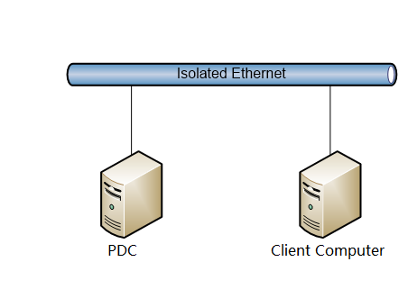

| &#32;| &#32;| &#32;| &#32;| &#32;| &#32; |
| -------------| -------------| -------------| -------------| -------------| ------------- |
| Machine Name/Access Point| NIC| IPv4| Subnet Mask| Default Gateway| DNS Server| 
| PDC| External1| 192.168.1.201| 255.255.255.0| 192.168.1.101| 127.0.0.1| 
| Client Computer| External1| 192.168.2.1| 255.255.255.0| 192.168.2.101| 192.168.1.201| 
| Driver Computer| External1| 192.168.1.101| 255.255.255.0|  &#60; empty &#62; | 192.168.1.201| 
|  | External1| 192.168.2.101| 255.255.255.0|  &#60; empty &#62; |  &#60; empty &#62; | 

Note
For Non-Windows, PDC, AD Client Computer could be replaced by the implementation-specific SUT.

### <a name="_Toc474756905"/>Verify Connectivity 

After you configure the environment, verify connections from the Driver Computer to the PDC and the AD Client Computer, and from the client computer to the PDC computer. The following provides a general list of steps that you can use to check for connectivity. For further information, see the administration guide for your operating system.

To check the connection from a Windows-based computer

Note 

Disable active firewalls in the test environment.

* Press **Win Key** + **R**.

* In the **Run** dialog box, type **cmd** and then click **OK**.

* At the command prompt, type **ping** followed by the hostname or IP address of the PDC or the client computer, and then press **Enter**. The following example checks the connection to the PDC with IP address 192.168.1.201:
>ping 192.168.1.201

* Repeat to confirm connectivity between all computers in the test environment.

###To check the connection from a non-Windows-based computer###

Note 
Disable active firewalls in the test environment.

* Start the terminal console.

* At the command prompt, type **ping** followed by the hostname or IP address of the PDC or the client computer, and then press **Enter**. The following example checks the connection to the PDC with IP address 192.168.1.201:

>ping 192.168.1.201

* Repeat to confirm connectivity between all computers in the test environment.

Important 

Do not proceed with the installation of the test suite until connectivity is confirmed. Any issues with network connectivity must be resolved before you configure the test suite.

## <a name="_Toc474756906"/>Computer Setup
This section explains how to setup the computers for the test environment.

### <a name="_Toc474756907"/>Setup a Windows-based PDC
This section provides information about how to setup a Windows-based PDC for use with this test suite.

To set up a Windows-based PDC:

* Configure IP addresses on the PDC and set the computer name.
* Disable IPv6.
* Turn off firewall. For Windows platform, refer to [Turn off Firewall](#_Toc474756909).
* Disable ICMP redirect. For Windows platform, refer to [Disable ICMP redirect](#_Toc474756914).
* Install Active Directory Domain Services. For Windows platform, refer to [Install Active Directory Domain Services](#_Toc474756910).
* Install DNS Service, refer to [Install DNS Service](#_Toc474756911).
* Create a forest root domain (i.e., contoso.com), and set domain Administrator’s password to “**Password01!**”. For Windows platform, refer to [Create a New Forest Root Domain](#_Toc474756912).

Note 

For an IPv4 environment, IPv6 must be disabled before installing Active Directory Domain Services.

### <a name="_Toc474756908"/>Common Setup Steps for Windows platform

#### <a name="_Toc474756909"/>Turn off Firewall
Run the following command in console window:

netsh advfirewall set allprofiles state off

#### <a name="_Toc474756910"/>Install Active Directory Domain Services
Run the following command in PowerShell.exe:

Install-WindowsFeature -name AD-Domain-Services –IncludeManagementTools

#### <a name="_Toc474756911"/>Install DNS Service
Execute the following steps to install DNS service:

* **Open** Server Manager.

* In the results pane, **click** Add roles and features.

* In the Add Roles Wizard, if the Before You Begin page appears, **click** Next.

* In the Roles list, **check** DNS Server, and then **click** Next.

* Read the information on the DNS Server page, and then **click** Next.

* On the Confirm Installation Options page, verify that the DNS Server role will be installed, and then **click** Install.

#### <a name="_Toc474756912"/>Create a New Forest Root Domain
Run the following command in PowerShell.exe:
Install-ADDSForest –DomainName contoso.com

#### <a name="_Toc474756913"/>Set private network
To configure computer to use private network:

* Press Win **Key** + **R**, then type secpol.msc.

* Click on "Network List Manager Policies".

* Double-click on your network.

* Click on Tab Network "Location"

* Set "Location Type" to "Private"

#### <a name="_Toc474756914"/>Disable ICMP redirect
To disable ICMP redirect, set the following registry key value:

HKLM:\SYSTEM\CurrentControlSet\Services\Tcpip\Parameters

### <a name="_Toc474756915"/>Setup a Non-Windows-based PDC
This section provides information about how to set up a non-Windows-based PDC for use with this test suite.

To set up a Non-Windows-based PDC (i.e., Samba):

* Install Samba 4 manually. See the guidelines for [How to Install Samba 4](#_Toc474756924) or go to the website at [http://www.samba.org](http://www.samba.org/).
* Configure Samba 4 as a PDC computer. See the guidelines for [How to Provision Samba 4 as a PDC](#z3e851c98bb1f412da82c849d3ce30dd1).
* Install the DNS server manually. For instructions, see the product documentation.

### <a name="_Toc474756916"/>Setup a Windows-based Client Computer
This section provides information about how to set up a Windows-based client computer for use with this test suite.

To setup a Windows-based Client Computer:

* Configure IP addresses on the Client Computer and set the computer name.
* Disable IPv6.
* Turn off firewall. For Windows platform, refer to [Turn off Firewall](#_Toc474756909).
* Disable ICMP redirect. For Windows platform, refer to [Disable ICMP redirect](#_Toc474756914).
* Make sure the network is set to use private network, refer to [Set private network](#_Toc474756913).
* Install test suite package to the Client Computer, refer to [Install Test Suite Package](#_Toc474756917).

#### <a name="_Toc474756917"/>Install Test Suite Package
Execute the following steps to install the test suite package.

* Install the required software, refer to [Software](#_Toc474756902).
* Extract all the files from the install package, find and run the extracted MS-ADOD-TestSuite-ODEP.msi file.
* For AD Client Computer, select Install and configure Windows System Under Test (SUT); For Driver Computer, select Install Test Suite on Driver Computer.

### <a name="_Toc474756918"/>Setup a Non-Windows-based Client Computer
This section provides information about how to set up a non-Windows-based client computer for use with this test suite.

To setup a non-Windows-based Client Computer:

* Install Samba 4 manually. See the guidelines for [How to Install Samba 4](#_Guidelines_for_Configuring_1) or go to the website at [http://www.samba.org](http://www.samba.org/).

* Set up the driver computer first. Non-Windows client computers cannot install MSI packages.

* After configuring the driver computer, copy the files under %systemdrive%\MicrosoftProtocolTests\MS-ADOD\OD-Endpoint\ &#60; _version_  &#35;  &#62; \Scripts\NonWindows\ to a folder on the non-Windows client computer. Record the path for later use.

* Install the Telnet server manually. For more information, see the product documentation.

### <a name="_Toc474756919"/>Setup the Driver Computer

Important 

Message Analyzer and its parsers, Visual Studio 2012, and the Protocol Test Framework must be installed on the driver computer before running the MS-ADOD -TestSuite-ODEP.msi installer.

To set up the Driver Computer:

* Configure IP addresses on the Driver Computer and set the computer name.
* Disable IPv6.
* Turn off firewall. For Windows platform, refer to [Turn off Firewall](#_Toc474756909).
* Make sure the network is set to use private network, refer to [Set private network](#_Toc474756913).
* Install test suite package to the Driver Computer, refer to [Install Test Suite Package](#_Toc474756917).

## <a name="_Toc474756920"/>Installed Files and Folders

The installation process for this test suite adds the following folders and files to the driver computer at %systemdrive%\MicrosoftProtocolTests\MS-ADOD\OD-Endpoint\ &#60; version &#35;  &#62; \.

Note 

The path may vary based on your installation location.
The  &#60; version &#35;  &#62;  placeholder indicates the installed build of the test suite.

|  **File or Folder**|  **Description**| 
| -------------| ------------- |
| Batch| Command files that you can use to configure the Driver Computer, the Client Computer and the PDC; command files that you can use to run individual test cases, BVT test cases, or all test cases| 
| Bin| Test suite binaries and configuration files| 
| Docs|  **[MS-ADOD].pdf**| 
| | **MS-ADOD _ODUserGuide.docx** – A user guide that explains how to install and configure the driver computer, the Client Computer, and the PDC, as well as how to run test cases.| 
| | **MS-ADOD_ODTestDesignSpecification.docx** – describes the MS-ADOD test suite design.| 
| Scripts| Scripts that are used to setup and configure the Windows-based Driver Computer, the Windows-based Client Computer and the Windows-based PDC. (To setup and configure the non-Windows-based computers, the scripts are listed under the “.\NonWindows” directory)| 

## <a name="_Toc474756921"/>Configuration

This section explains how to configure the computers in the test environment for this test suite.

### <a name="_Toc474756922"/>Configure the Windows-based Client Computer 

This section provides a general list of steps that you can use to configure the client computer in a Windows-based test environment. For specific information about how to complete these steps, see the administration guide for your operating system.

To configure the driver computer

* **Log on** to the client computer as the local administrator.

* Start PowerShell by **right-clicking** on the Windows PowerShell icon, and then **click** Run as Administrator.

Or, from a Windows PowerShell command window, **type**:

Start-process PowerShell -verb runAs

* At the command prompt, **type** Set-ExecutionPolicy Unrestricted -F, and press **Enter**.

* **Type** cd %systemdrive%\MicrosoftProtocolTests\MS-ADOD\OD-Endpoint\ _&#60; version &#35;  &#62;_ \Scripts, and press **Enter**.

* **Edit** the ParamConfig.xml file according to the actual environment and save.

* **Type** .\Config-ClientComputer.ps1, and press **Enter**.

* **Check** config-clientcomputer.complete.signal appears under System Drive after configuration script finished.

* **Type** services.msc to open the Services manager.

* **Set** the Windows Remote Management (WS-Management) service startup type to Automatic.

* **Restart** the computer.

### <a name="_Toc474756923"/>Configure the Driver Computer 

This section provides a general list of steps that you can use to configure the driver computer in a Windows-based test environment. For specific information about how to complete these steps, see the administration guide for your operating system.

To configure the driver computer

* Verify that the client computer is configured and running.

* **Log on** to the driver computer as the local administrator.

* Go to %systemdrive%\MicrosoftProtocolTests\MS-ADOD\OD-Endpoint\ &#60; version &#35;  &#62; \Scripts, and open the ParamConfig.xml file.

* **Edit** the properties as shown in the following table.

|  **Property**|  **Description**| 
| -------------| ------------- |
| clientLogPath| The client computer path for configuration logs and test suite adapter script logs. | 
| | Default value: %systemdrive%\Logs| 
| driverLogPath| The driver computer path for configuration logs and test suite adapter scripts logs.  | 
| | Default value: %systemdrive%\Logs| 
| localCapFilePath| The local computer path for Message Analyzer Capture files. “Local” refers to all computers that have Message Analyzer installed.| 
| | Default value: %systemdrive%\Logs\Capture| 
| fullDomainName| The fully-qualified domain name of the test domain.| 
| | Default value: contoso.com| 
| domainAdminUserName| The username for the administrator account on the PDC computer.| 
| | Default value: Administrator| 
| domainAdminUserPwd| The password for the administrator account on the PDC computer.| 
| | Default value: Password01!| 
| pdcOperatingSystem| The operating system of the PDC computer. The value can be Windows or NonWindows.| 
| | Default value: Windows| 
| pdcComputerName| The computer name of the PDC computer.| 
| | Default value: PDC.contoso.com| 
| pdcIP| The computer IP address of the PDC computer.| 
| | Default value: 192.168.1.201| 
| clientOperatingSystem| The operating system of the client computer. The value can be Windows or NonWindows.| 
| | Default value: Windows| 
| clientComputerName| The computer name of the client computer.| 
| | Default value: ENDPOINT01| 
| clientIP| The computer IP address of the client computer.| 
| | Default value: 192.168.2.101| 
| clientAdminUserName| The username for the administrator account on the client computer.| 
| | Default value: Administrator| 
| clientAdminUserPwd| The password for the administrator account on the client computer.| 
| | Default value: Password01!| 
| ipVersion| The IP version under test.| 
| | Default value: IPv4| 

* Start PowerShell by right-clicking on the **Windows PowerShell** icon, and then click **Run as Administrator**. 
Or, from a Windows PowerShell command window, type: 

Start-process PowerShell -verb runAs

* At the command prompt, type:

Set-ExecutionPolicy Unrestricted –F, and press **Enter**.

* Type cd %systemdrive%\MicrosoftProtocolTests\MS-ADOD\OD-Endpoint\ &#60; version &#35;  &#62; \Scripts, and press **Enter**.

* **Restart** the driver computer and log on as the local administrator.

* Type .\Config-DriverComputer.ps1, and press **Enter**.

* Type services.msc to open the **Services manager**.

* Set the **Remote Access Connection Manager** service startup type to **Automatic**.

* **Restart** the computer.

### <a name="_Toc474756924"/>Configuring the Non-Windows PDC
This section provides general instructions for configuring a PDC computer that runs an operating system other than the Windows operating system. For detailed instructions about how to complete the tasks that this process requires, see the administration guide for your operating system.

To configure the non-Windows PDC

* Before installing Samba 4, make sure you remove any current Samba  4 files:
		_rm –rf /usr/local/samba_

* Extract all of the Samba 4 TAR files.

* Build Samba 4:
	_cd samba-master_
	_./configure.developer_
	_make_

* Install Samba 4:
	_cd samba-master_
	_make install_

* Provision Samba 4 as a PDC, create a Kerberos realm, define a NT4 domain name, and define the domain administrator password on the PDC computer:
	_source4/setup/provision --realm=contoso.com --domain=CONTOSO --adminpass=Password01! --server-role=dc_

* Optionally, set environment variables to simplify Samba usage.

* Configure DNS.

* Start Samba.

### <a name="_Toc474756925"/>Configuring the Non-Windows Client Computer

This section provides general instructions for the configuration of a client computer that runs an operating system other than the Windows operating system. For detailed instructions about how to complete the tasks that this process requires, see the administration guide for your operating system. 

To configure the non-Windows client computer

* Before installing Samba 4, make sure you remove any current Samba  4 files:
	_rm –rf /usr/local/samba_

* Extract all Samba 4 TAR files.

* Build Samba 4:
	_cd samba-master_
	_./configure.developer_
	_make_

* Install Samba 4:
	_cd samba-master_
	_make install_

* Configure the /etc/resolv.conf file, add hostname to IP mappings. 

### <a name="_Toc474756926"/>Configuring the Test Suite

This test suite is installed with default configuration settings. You may need to change these settings if you use a customized test environment or if you customize your test runs. 

You can define various required and optional settings for the test suite, such as the following:

* Define the settings of the test environment, including computer names and IP addresses.

* Define the basic options used in the test suite; for example, specify if the client computer operating system platform is Windows or Non-Windows.

* Define the folders used to store output and logs from test runs.

* Define the location of scripts to run before each test run.

* Set time limits on discrete test tasks and for test runs.

To change configuration settings for this suite, edit the MS-ADOD_ODTestSuite.deployment.ptfconfig file. You can find this file in the directory %systemdrive%\MicrosoftProtocolTests\MS-ADOD\OD-Endpoint\ &#60; version &#35;  &#62; \Bin.

#### <a name="_Toc474756927"/>Required Configuration Settings

The following table describes the required configuration properties and their values. 

| &#32;| &#32; |
| -------------| ------------- |
|  **Property**|  **Description**| 
| FullDomainName| The fully-qualified domain name of the domain under testing.| 
| | Default value: contoso.com| 
| DomainNC| The domain naming context of the domain under testing.| 
| | Default value: DC=contoso,DC=com| 
| PartitionsNC| The FQDN for the partitions container in the domain under testing.| 
| | Default value: CN=Partitions,CN=Configuration,DC=contoso,DC=com| 
| DomainAdminUsername| The username for the administrator account on the PDC computer.| 
| | Default value: Administrator| 
| DomainAdminPwd| The password for the administrator account on the PDC computer.| 
| | Default value: Password01!| 
| PDCOperatingSystem| The operating system of the PDC.  The value can be Windows or NonWindows.| 
| | Default value: Windows| 
| PDCComputerName| The PDC computer name.| 
| | Default value: PDC.contoso.com| 
| PDCIP| The PDC IP address.| 
| | Default value: 192.168.1.201| 
| ClientOperatingSystem| The operating system of the client computer. The value can be Windows or Non-Windows.| 
| | Default value: Windows| 
| ClientOSVersion| The operating system version of the client computer. If the client computer is non-windows, this value should be the Windows OS Version that the client computer is referring to.| 
| | Default value: 6.2| 
| ClientComputerName| The client computer name.| 
| | Default value: ENDPOINT01| 
| ClientIP| The IP address of the client computer.| 
| | Default value: 192.168.2.1| 
| ClientAdminUsername| The username for the administrator account on the client computer.| 
| | Default value: Administrator| 
| ClientAdminPwd| The password for the administrator account on the client computer.| 
| | Default value: Password01!| 
| LocalCapFilePath| The local path for Message Analyzer capture files.  “Local” refers to all computers that have Message Analyzer installed.| 
| | Default value: %systemdrive%\Logs\Capture| 
| DriverLogPath| The driver computer path for configuration logs and test suite adapter scripts logs.| 
| | Default value: %systemdrive%\Logs\Driver| 
| ClientLogPath| The client computer path for configuration logs and test suite adapter scripts logs.| 
| | Default value: %systemdrive%\Logs\Client| 
| TriggerDisabled| The boolean flag indicating whether the client triggering should be disabled or not. If disabled, the test case will only verify the captured messages; else, client computer will be triggered to send some requests to the PDC for a particular test purpose.| 
| | Default value: false| 

#### <a name="_Toc474756928"/>Optional Configuration Settings

The following table describes the optional configuration properties and their values. 

| &#32;| &#32; |
| -------------| ------------- |
|  **Property**|  **Description**| 
| TelnetPort| The telnet port number for a telnet connection, this configuration is for non-Windows operating systems only.| 
| | Default value: 23| 
| LocateDomainControllerScript| The script name for the “locate domain controller” test case. Use this configuration option only when the driver computer is not running the Windows operating system and it is using a telnet connection to trigger the test case.| 
| | Default value: LocateDomainController.sh| 
| JoinDomainCreateAcctLDAPScript| The script name for the “join domain by creating an account using LDAP” test case. Use this configuration option only when the driver computer is not running the Windows operating system and it is using a telnet connection to trigger the test case.| 
| | Default value: JoinDomainCreateAcctLDAP.sh| 
| JoinDomainPredefAcctScript| The script name for the “join domain by a predefined account” test case. Use this configuration option only when the driver computer is not running the Windows operating system and it is using a telnet connection to trigger the test case.| 
| | Default value: JoinDomainPredefAcct.sh| 
| UnjoinDomainScript| The script name for the “unjoin domain” test case. Use this configuration option only when the driver computer is not running the Windows operating system and it is using a telnet connection to trigger the test case.| 
| | Default value: UnjoinDomain.sh| 
| IsJoinDomainSuccessScript| The script name for the “checking if joining domain is successful” test case. Use this configuration option only when the driver computer is not running the Windows operating system and it is using a telnet connection to trigger the test case.| 
| | Default value: IsJoinDomainSuccess.sh| 
| IsUnjoinDomainSuccessScript| The script name for the “checking if unjoining domain is successful” test case. Use this configuration option only when the driver computer is not running the Windows operating system and it is using a telnet connection to trigger the test case.| 
| | Default value: IsUnjoinDomainSuccess.sh| 

#### <a name="_Toc474756929"/>Protocol Test Manager
The configuration files can be not only changed manually, but also can be changed by using a UI tool named Protocol Test Manager (PTM). Please go to [Using Protocol Test Manager](#_Using_Protocol_Test) to see the detailed information.

## <a name="_Toc474756930"/>Running Test Cases

This test suite includes command files that you can use to complete basic test cases. Each test case verifies the protocol implementation based on a given scenario. 

A common pattern for the test scenarios is as follows:

* Ensure the remote session successfully established between driver computer and the target computer (PDC or client computer).

* Initialize the test case on the PDC computer.

* Initialize the status of the client computer.

* Trigger the test case on the client computer.

* Verify test case results using client and PDC computer status.

* Verify message sequences in the Network Monitor capture files.

* Complete post-test cleanup. 

You can find and run these test cases in the following directory: 

%systemdrive%\MicrosoftProtocolTests\MS-ADOD\OD-Endpoint\ &#60; version &#35;  &#62; \Batch

### <a name="_Toc474756931"/>Run All Test Cases

Use the steps below to run all test cases. Shortcuts listed are created during the installation process.

###To run all test cases###

* From the desktop of the driver computer, double-click the **Run MS-ADOD-OD EP Test Cases** shortcut. 

* Alternatively, go to %systemdrive%\MicrosoftProtocolTests\MS-ADOD\OD-Endpoint\ _&#60; version &#35;  &#62;_ \Batch and double-click the **RunAllTestCases.cmd** file. 

### <a name="_Toc474756932"/>Run Specified Test Cases

Use the steps below to run specific test cases.

###To run specified test cases###

* From the directory %systemdrive%\MicrosoftProtocolTests\MS-ADOD\OD-Endpoint\ _&#60; version &#35;  &#62;_ \Batch, double-click the batch file for the test case that you want to run.

### <a name="_Toc474756933"/>Check Test Results
The handling of test results involves both the review of log files and the management of their generation. This section describes those topics.

#### <a name="_Toc474756934"/>Review the Test Log Files

By default, the test suite creates log files in the **TestResults** directory, a subfolder of Batch folder in the test suite installation directory. The log files that contain test suite results use a  &#42; **.trx** file name, in which the asterisk (“ &#42; ”) character represents the user name, the test case name, or both.

Additional log files are used for requirement coverage information and identification of test issues. Their settings are located in the  &#42; **.ptfconfig** or  &#42; **.deployment.ptfconfig** files. You can set the file names, paths, and formats in the Sinks node of the configuration file. 

The following instruction provides an example of how to prevent log entries for the "Debug" logging sink from being written into the MS-ADOD_Log.xml file in the current directory:
 
 &#60; File id="ReqLog" directory=".\" file="MS-ADOD_Log.xml" format="xml"/ &#62; 

#### <a name="_Toc474756935"/>Review the PowerShell Log Files
PowerShell log file locations are set to use the **DriverLogPath** value in the  &#42; **.deployment.ptfconfig** configuration file. The log files that contain PowerShell runtime logs use the  &#60; testcase &#35;  &#62; **.log** naming convention.

#### <a name="_Toc474756936"/>Manage the Generation of Log Files

The log files contain a range of information including, but not limited to, the following:

* Test computer client and server names

* Internet Protocol (IP) addresses

* User names and passwords

* Domain names and test domain names

* User account settings associated with Windows Active Directory

**Note** This information is not sent to Microsoft. 

If you do not need the log files for debugging, you can delete them. You can also control the generation of all log files for the test suite, except for test result ( &#42; .trx) files. 

The following describes how to stop the generation of log files using the file name extensions of .txt and .xml. This process should be followed _before_ you run test cases in Visual Studio.

###To prevent the generation of .txt and .xml type log files###

Note 

This procedure assumes that the test suite was installed at the **C:** root directory. MS- ADOD represents the protocol name.

* Open the MS-ADOD _ODTestSuite.ptfconfig file. You can find this configuration file at the path %systemdrive%\MicrosoftProtocolTests\MS-ADOD\OD-Endpoint\ &#60; version &#35;  &#62; \Source\OD\TestCode\TestSuite. Or, if you use batch files to run your test cases, you can find this file at %systemdrive%\MicrosoftProtocolTests\MS-ADOD\OD-Endpoint\ &#60; version &#35;  &#62; \Bin.

* Locate the Sinks node and comment out all the entries.

* Locate the Profile node and comment out all the entries.

* Locate the Profile node and add the following entries:

&#60; Rule kind="CheckSucceeded" sink="Console" delete="false" / &#62; 
&#60; Rule kind="Comment" sink="FileLog" delete="false"/ &#62; 
&#60; Rule kind="Debug" sink="FileLog" delete="false" / &#62; 
&#60; Rule kind="Checkpoint" sink="ReqLog" delete="false"/ &#62; 
&#60; Rule kind="Comment" sink="ReqLog" delete="false"/ &#62; 
&#60; Rule kind="Checkpoint" sink="Beacon" delete="false"/ &#62;    

For further information about logging in the Protocol Test Framework (PTF), see the _PTF User Guide_ in the PTF installation directory.

## <a name="_Toc474756937"/>Debugging Test Cases

You can use the Visual Studio solution (.sln) file included with this test suite to debug additional test cases that you create for your protocol implementation. 

Note 

While using Microsoft® Visual Studio® 2012 or above to run test cases, test suite may throw exception with message of “Cannot get test site”. To solve this issue, please select the test settings file under test settings menu.

>

Note 

Remember to copy MS-ADOD_ODTestSuite.deployment.ptfconfig file from the %systemdrive%\MicrosoftProtocolTests\MS-ADOD\OD-Endpoint\ &#60; version &#35;  &#62; \Bin folder to %systemdrive%\MicrosoftProtocolTests\MS-ADOD\OD-Endpoint\ &#60; version &#35;  &#62; \Source\OD\TestCode\TestSuite and replace the original files if your original run is through batch files.

###To debug a test case###

* On the driver computer, use Microsoft® Visual Studio® to open the following solution file:
%systemdrive%\MicrosoftProtocolTests\MS-ADOD\OD-Endpoint\ _&#60; version &#35;  &#62;_ \Source\OD\TestCode\MS-ADOD_OD.sln

* In Visual Studio, in the Solution Explorer window, right-click the ‘**MS-ADOD_OD**’ solution, and select **Build Solution**.

* When you build the test project, the tests appear in **Test Explorer**. If Test Explorer is not visible, choose **Test** on the Visual Studio menu, choose **Windows**, and then choose **Test Explorer**.

* Select your test cases from Test Explorer and run or debug them.

## <a name="_Toc474756938"/>Using Protocol Test Manager
Protocol Test Manager (PTM) is a graphical front-end for Windows protocol test suites. You can configure and run test suites from the Protocol Test Manager.

### <a name="_Toc474756939"/>Install Protocol Test Manager
Install the test suite and all its dependencies.
Launch the ProtocolTestManager.msi and install the Protocol Test Manager.

### <a name="_Toc474756940"/>Start Protocol Test Manager
Open the Protocol Test Manager from the shortcut on the desktop.

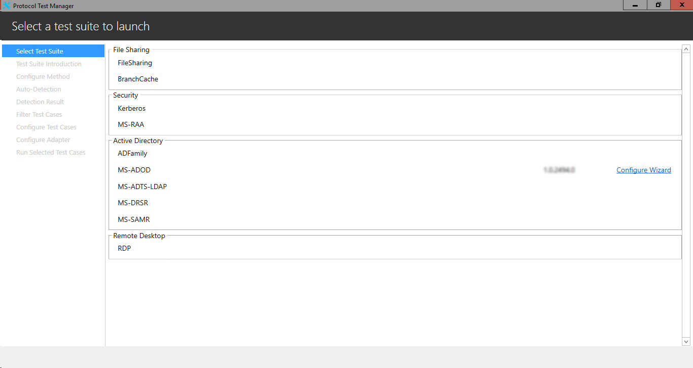

Only the installed protocol test suite is usable. At the first time you need to click “Configure Wizard” to configure the protocol test suite. Once the test suite is configured with PTM, you can click “Run” to run the test suite with last settings.

### <a name="_Toc474756941"/>Configure the Test Suite

#### <a name="_Toc474756942"/>Test Suite Introduction
The test suite introduction page provides you some general information about the test suite. You may click the hyperlinks in this page to see more details about the test environment.
All the steps are listed in the left part of the windows. You may go back to the previous steps from the list. If you change any settings, you need to click “Next” to apply your changes.

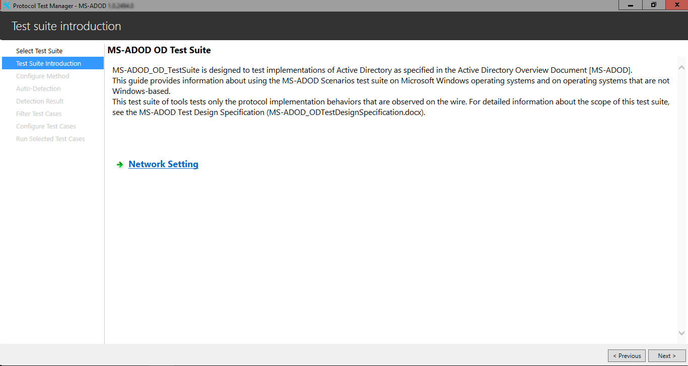

You may press Alt button to show the access keys:

For example: Alt+P for Previous, Alt+N for Next.
There are no configurations in this page. You may click “Next” to choose how to configure the test suite. 

#### <a name="_Toc474756943"/>Configure the Test Suite with Auto-Detection
Choose Run Auto-Detection to begin auto-detection.

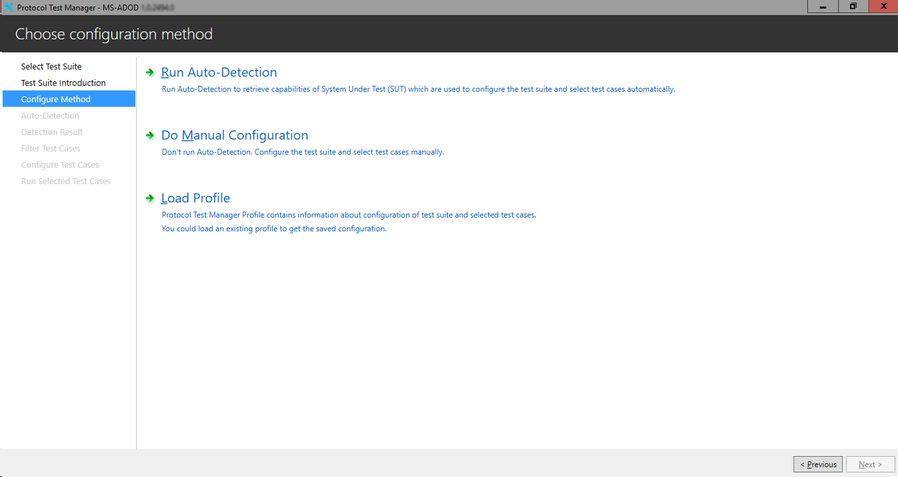

Set the prerequisite properties needed for auto-detection. The prerequisite properties include domain information (i.e., FQDN, Domain Administrator Username and Password), PDC information (i.e., PDC Operating System, PDC Computer Name, and PDC IP Address), AD Client Computer information (i.e., Client Computer Operating System, Client OS Version, Client Computer Name, Client IP Address, and Client Local Administrator Username and Password), and whether you want to do an offline capture testing when you already have all the messages captured (Enable Offline Capture Testing, Capture File Path). Please be noted that you can scroll-down to view all the configuration items.
Click **Detect** to begin the detection. The detection steps are as listed:

* Check whether Message Analyzer is properly installed.

* Verify availability of domain by pinging the domain name.

* Ping PDC.

* Ping Client Computer.

* Verify Offline Capture Path.

If you set the “Enable Offline Capture Testing” to be true, Detect Step 2-4 will be skipped. Otherwise, if you set the “Enable Offline Capture Testing” to be false, Detect Step 5 will be skipped. Step 1 will always be verified.

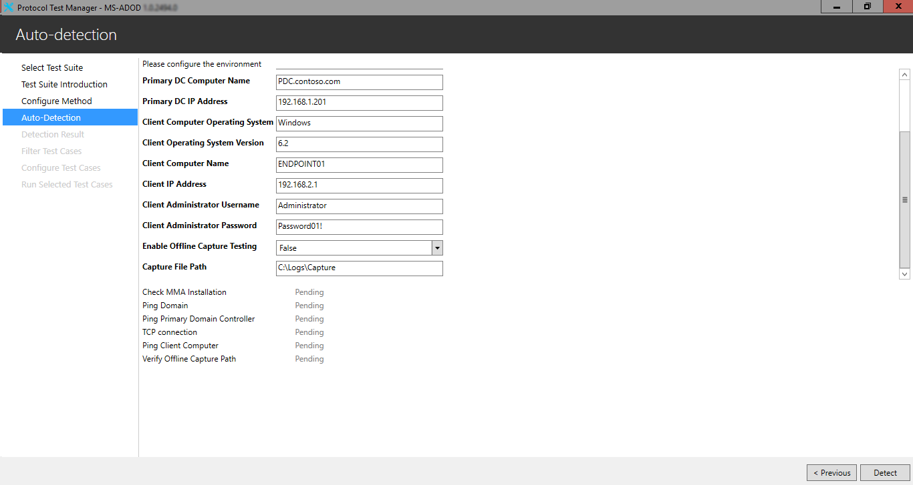

When the detection is finished, click “Next” to see the detection result. The detection results will include the domain information, the PDC information and the AD Client Computer information.

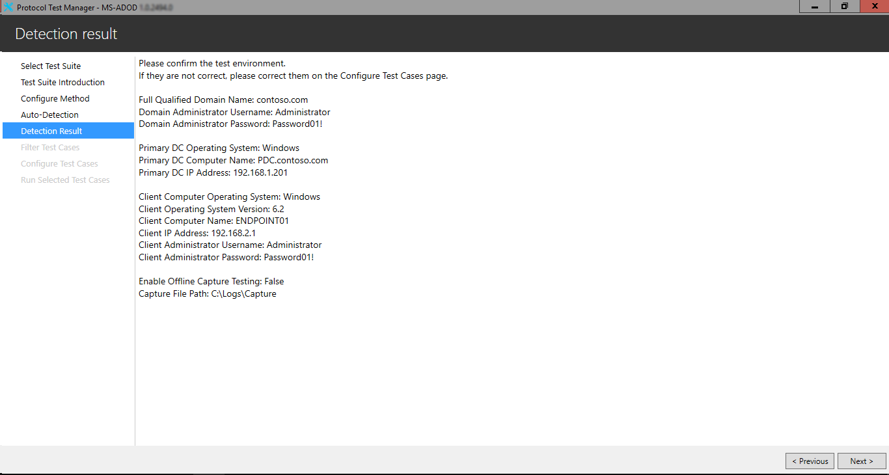

Click “Next” to filter the test cases.

#### <a name="_Toc474756944"/>Filter Test Cases
Filter the test cases. The test cases will be grouped into only 2 categories, BVT and non-BVT. The BVT cases will include the domain services cases such as locate domain controller and join domain. The rest will be categorized into non-BVT cases.

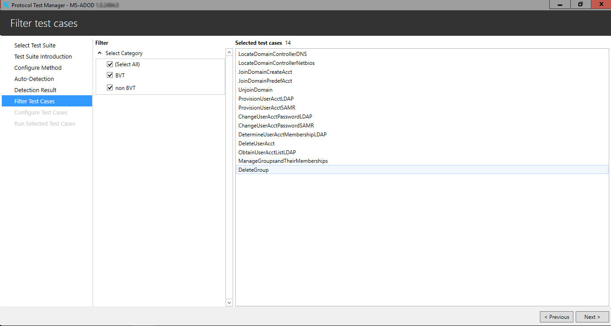

Click “Next” to configure the properties of the test suite.

#### <a name="_Toc474756945"/>Configure Test Cases

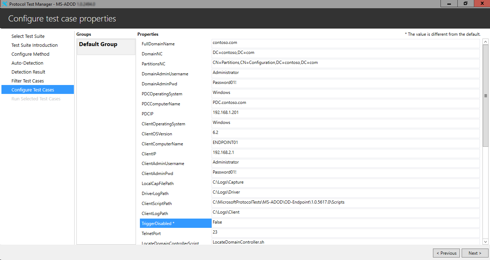

For more information about the configurations of the test cases, please refer to [Required Configuration Settings](#_Required_Configuration_Settings) and [Optional Configuration Settings](#_Optional_Configuration_Settings).

#### <a name="_Toc474756946"/>Configure Test Suite Manually
Click Do Manual Configuration on the Configure Method page to go to the Filter Test Cases page directly without using auto-detection. You may select the test cases and configure the properties manually.

### <a name="_Toc474756947"/>Run Selected Test Cases
You can run the selected test cases in the run page.
The selected test cases are listed. If a test case is executed, you can click this test case and the test log of the case is shown in the test logs window.
You may drag the separator between the case list and the log to adjust the width of the window.

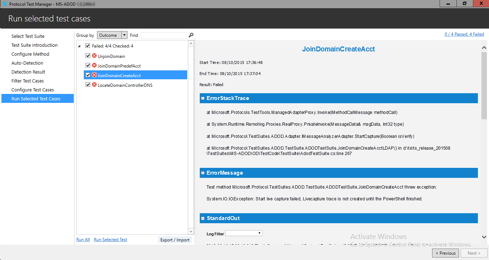

You may right click on the test cases to uncheck all the test cases.

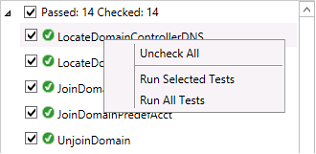

Click “Run All” to run all the test cases. Click “Run Selected Test” to run only the checked test cases.

After the test cases are run, you can click the hyperlink at the upper right corner to open the result folder of the test suite. This folder contains the .trx Visual Studio Test Result files and other log files.

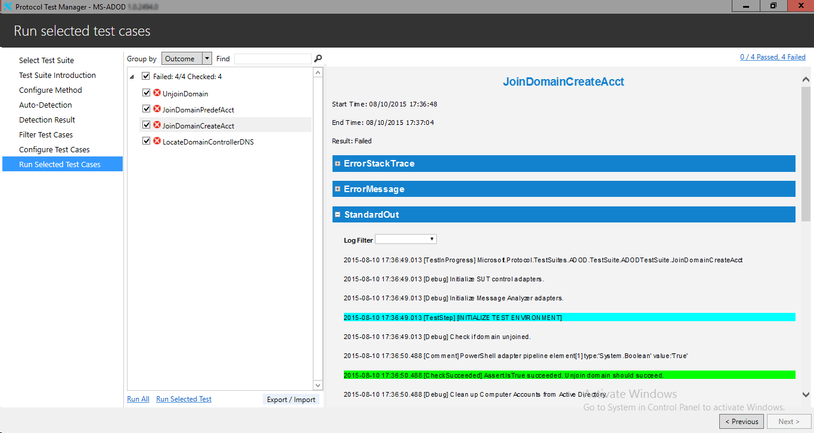

You may group the test cases by either the outcome or the category. If a test case belongs to multiple categories, it is listed in each category. You may also find test cases by name. Enter the keywords in the text box then press Enter or click the button next to the text box. Only the test cases which contains the keyword is listed.
Click the cross button to remove the keyword and show all the test cases.
The keyword is case-insensitive.

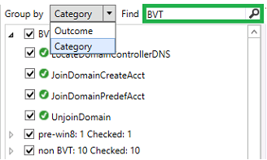

#### <a name="_Toc474756948"/>Save and Load Configurations
Click “Save Profile” to save all the settings as a profile. The settings include the test case selection and the property values. You may load the saved settings by Load Profile in the Configure Method page.

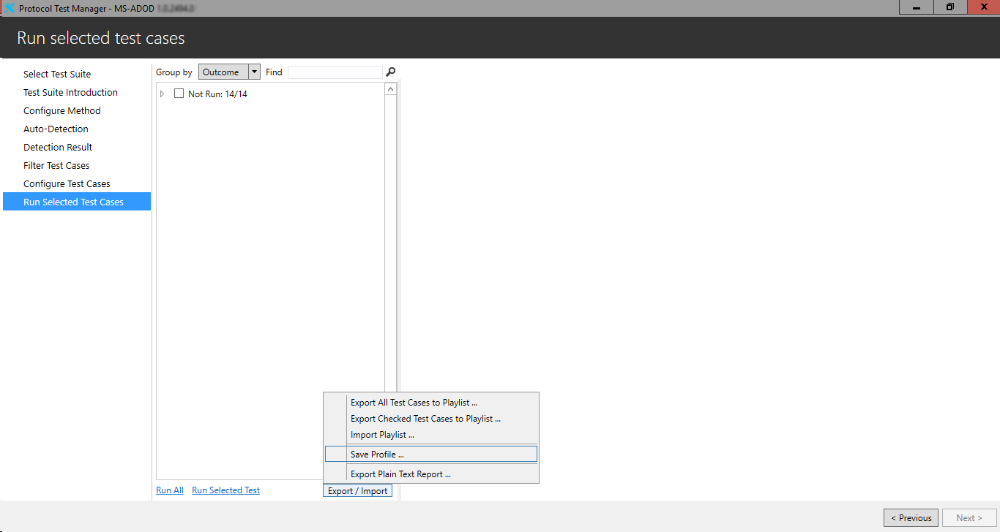

## <a name="_Toc474756949"/>Troubleshooting

This section describes how to troubleshoot common issues in running test cases.

### <a name="_Toc474756950"/>Ping Failure

| &#32;| &#32; |
| -------------| ------------- |
| PROBLEM| The domain controller does not respond to pings from the client computer.| 
| CAUSE| The driver computer is not in the same subnet as the domain controller, or the domain controller firewall is enabled. | 
| RESOLUTION| Move the driver computer and the domain controller to the same subnet, or disable the domain controller firewall.| 

### <a name="_Toc474756951"/>Remote Session Setup Failure

| &#32;| &#32; |
| -------------| ------------- |
| PROBLEM| Remote sessions cannot be established from the driver computer to the client computer.| 
| CAUSE| The client computer and driver computer network sharing is not turned on. | 
| RESOLUTION| Turn on the sharing and connect to devices by changing the network settings to private networks.| 

### <a name="_Toc474756952"/>Test Run Issues

| &#32;| &#32; |
| -------------| ------------- |
| PROBLEM| The test suite is not running as expected| 
| CAUSE| The .ptfconfig file was not found or the configuration property values were not set.| 
| RESOLUTION| Copy the .ptfconfig file to the path %systemdrive%\MicrosoftProtocolTests\MS-ADOD\OD-Endpoint\ &#60; version &#35;  &#62; \OD\TestCode\TestSuite and verify the values in the file.| 

## <a name="_Toc474756953"/>Appendix

This section describes information on extra configurations and settings.

### <a name="_Toc474756954"/>How to Setup SNTP/NTP Server

When configured correctly, one can use the Windows Time (W32Time) service as an SNTP/NTP server for both windows and non-windows SNTP/NTP client.

Setup steps:

* Click **Start**, click **Run**, type regedit, and then click **OK**.

* Set domain controller always advertise reliable time service:

* Locate and then click the following registry entry: KEY_LOCAL_MACHINE\SYSTEM\CurrentControlSet\Services\W32Time\Config\.

* In the right pane, right-click **AnnounceFlags**, and then click **Modify**.

* In the **Edit DWORD Value** dialog box, under **Value data**, type 5, and then click **OK**.

* Enable NTP Server:

* Locate and then click the following registry subkey: HKEY_LOCAL_MACHINE\SYSTEM\CurrentControlSet\Services\W32Time\TimeProviders\NtpServer\.

* In the right pane, right-click **Enabled**, and then click **Modify**.

* In the **Edit DWORD Value** dialog box, type 1 under **Value data**, and then click **OK**.

* Exit Registry Editor.

* Restart Windows Time service:

* At the command prompt, type the following command to restart the Windows Time service, and then press **ENTER**.

* Enter “net stop w32time”

* Enter “net start w32time”
Tips:

* Make sure W32Time is set to Automatic startup mode. 

* Make sure UDP 123 is allowed through your firewall.