# MS-AZOD Test Suite User Guide 

## Contents
* [Introduction](#_Toc426622584)
* [License Information](#_Toc426622585)
* [Further Assistance](#_Toc426622586)
* [Quick Start Checklist](#_Toc426622587)
* [How Do I?](#_Toc426622588)
* [Requirements](#_Toc426622589)
* [Environment](#_Toc426622590)
    * [Local-Realm KDC](#_Toc426622591)
    * [Trust-Realm KDC](#_Toc426622592)
    * [Local-Realm Application Server (AP)](#_Toc426622593)
    * [Trust-Realm Application Server (AP)](#_Toc426622594)
    * [Client Computer (Client)](#_Toc426622595)
    * [Software](#_Toc426622596)
* [Network Setup](#_Toc426622597)
    * [Network Infrastructure](#_Toc426622598)
    * [Single Realm Environment](#_Toc426622599)
    * [Cross-Forest Trust Environment](#_Toc426622600)
    * [Verify Connectivity](#_Toc426622601)
* [Computer Setup](#_Toc426622602)
    * [Set Up the Local /Trust-Realm KDC](#_Toc426622603)
    * [Set Up the Local /Trust-Realm AP](#_Toc426622604)
    * [Set Up the Client Computer](#_Toc426622605)
    * [Installed Files and Folders](#_Toc426622606)
* [Configuration](#_Toc426622607)
    * [Configure the Local-Realm KDC](#_Toc426622608)
    * [Configure the Local-Realm AP](#_Toc426622609)
    * [Configure the Trust-Realm KDC](#_Toc426622610)
    * [Configure the Trust-Realm AP](#_Toc426622611)
    * [Configure the Client Computer](#_Toc426622612)
* [Configuring the Test Suite](#_Toc426622613)
    * [Required Configuration Settings](#_Toc426622614)
    * [Optional Configuration Settings](#_Toc426622615)
* [Running Test Cases](#_Toc426622616)
    * [Run All Test Cases](#_Toc426622617)
    * [Run Specified Test Cases](#_Toc426622618)
    * [Check Test Results](#_Toc426622619)
* [Debugging Test Cases](#_Toc426622620)
* [Troubleshooting](#_Toc426622621)
    * [Ping Failure](#_Toc426622622)
    * [Test Run Issues](#_Toc426622623)
* [Appendix: Build the Cross-realm Trust Relationship between Windows AD and MIT KDC](#_Toc426622624)
    * [Overview](#_Toc426622625)
    * [Configuring the MIT KDC](#_Toc426622626)
		* [Install Fedora 17](#_Toc426622627)
		* [Install MIT KDC](#_Toc426622628)
    * [Configuring the Windows DNS and AD](#_Toc426622629)
		* [Install DNS Server](#_Toc426622630)
		* [Install Windows AD](#_Toc426622631)
    * [Setting Trust between Windows AD and MIT KDC](#_Toc426622632)
		* [Configure the Windows AD](#_Toc426622633)
		* [Configure the MIT KDC](#_Toc426622634)
		* [Create account mappings](#_Toc426622635)
		* [Verify the cross-realm trust relationship](#_Toc426622636)
* [Reference](#_Toc426622637)

## <a name="_Toc426622584"/>Introduction

This guide provides information about how to install, configure, and run the MS-AZOD Test Suite and its environment. This suite is designed to test implementations of MS-AZOD Protocols, as specified in the Microsoft documents and their referenced dependencies. The MS-AZOD test suite consists of _Microsoft protocol Authorization Protocols Overview [MS-AZOD]._ The guide provides information about using the test suite on Microsoft Windows operating systems and on operating systems that are not Windows-based.

This suite of tools tests only the protocol implementation behaviors that are observed on the wire. For detailed information about the scope of this test suite, see _MS-AZOD Test Design Specification (MS-AZOD_ODTestDesignSpecification.docx)_.

## <a name="_Toc426622585"/>License Information

For licensing information, see the End User License Agreement (EULA) that was provided with this test suite. The EULA is contained in the EULA.rtf file in the installation folder.

## <a name="_Toc426622586"/>Further Assistance

If you need further information about this test suite or assistance in troubleshooting issues related to this test suite, contact dochelp@microsoft.com.

## <a name="_Toc426622587"/>Quick Start Checklist

The following checklist summarizes the steps required to get the test suite up and running. The checklist also provides references to documentation that can help you get started. 

|  **Check**|  **Task**|  **Topic**| 
| -------------| -------------| ------------- |
| □| Download the test suite for the protocol implementation| For a list of the files that the download package contains, see [Installed Files and Folders](#_Toc426622606).| 
| □| Confirm that your test environment and computers meet the requirements of the test suite| For information about the requirements of the test suite, see [Requirements](#_Toc426622589). | 
| □| Install the software prerequisites| For information about software that must be installed on the computers in your test environment before the test suite is installed, see [Software](#_Toc426622596).| 
| □| Set up the Local-Realm Key Distribution Center (KDC) Computer| See [Set Up the Local-Realm/Trust-Realm KDC Computer](#_Toc426622603).| 
| □| Set up the Trust-Realm Key Distribution Center (KDC) Computer| See [Set Up the Local-Realm/Trust-Realm KDC Computer](#_Toc426622603).| 
| | | Note: only for cross realm scenario.| 
| □| Set up the Local-Realm Application Server (AP) Computer| See [Set Up the Local-Realm/Trust-Realm Application Server Computer](#_Toc426622604).| 
| □| Set up the Trust-Realm Application Server (AP) Computer| See [Set Up the Local-Realm/Trust-Realm Application Server Computer](#_Toc426622604).| 
| | | Note: only for cross realm scenario.| 
| □| Set up the Client Computer| See [Set Up the Client Computer](#_Toc426622605).| 
| □| Set up the network| See [Network Setup.](#_Toc426622597)| 
| □| Verify the connection from the driver computer to the SUT and other computers| See [Verify Connectivity](#_Toc426622601).| 
| □| Configure the Local-Realm KDC computer| See [Configure the Local-Realm KDC Computer](#_Toc426622608).| 
| □| Configure the Trust-Realm KDC computer| See [Configure the Trust-Realm KDC Computer](#_Toc426622610).| 
| | | Note: only for cross realm scenario.| 
| □| Configure the Local-Realm Application Server computer| See [Configure the Local-Realm Application Server Computer](#_Toc426622609).| 
| □| Configure the Trust-Realm Application Server computer| See [Configure the Trust-Realm Application Server Computer](#_Toc426622611).| 
| | | Note: only for cross realm scenario.| 
| □| Configure the Client computer| See [Configure the Client Computer](#_Toc426622612).| 
| □| Configure test suite settings| See [Configuring the Test Suite](#_Toc426622613).| 

## <a name="_Toc426622588"/>How Do I?
Use the following quick reference to learn how to complete common tasks.

|  **How do I…?**|  **For more information…**| 
| -------------| ------------- |
| Set up the test environment| [Network Setup](#_Network_Setup) and [Computer Setup](#_Toc426622602)| 
| Verify the connection from the driver computer to other computers and between other computers in the test environment| [Verify Connectivity](#_Toc426622601)| 
| Setup the Local-Realm/Trust-Realm KDC Computer| [Set Up the Local-Realm/Trust-Realm KDC Computer](#_Toc426622603)| 
| Setup the Local-Realm/Trust-Realm Application Server Computer| [Set Up the Local-Realm/Trust-Realm Application Server Computer](#_Toc426622603)| 
| Setup the Client Computer| [Set Up the Client Computer](#_Toc426622605)| 
| Configure the Local-Realm KDC Computer| [Configure the Local-Realm KDC Computer](#_Toc426622608) or [Configure a KDC Computer that is Not Windows-based](#_Toc426622613)| 
| Configure the Trust-Realm KDC Computer| [Configure the Trust-Realm KDC Computer](#_Toc426622610) or [Configure a KDC Computer that is Not Windows-based](#_Toc426622613)| 
| Configure the Local-Realm Application Server Computer| [Configure the Local-Realm Application Server Computer](#_Toc426622609) or [Configure an Application Server Computer that is Not Windows-based](#_Toc426622613)| 
| Configure the Trust-Realm Application Server Computer| [Configure the Trust-Realm Application Server Computer](#_Toc426622611) or [Configure an Application Server Computer that is Not Windows-based](#_Toc426622613)| 
| Configure the Client Computer| [Configure the Client Computer](#_Toc426622612)| 
| Configure the test suite settings| [Configuring the Test Suite](#_Toc426622613)| 
| Run test cases| [Run All Test Cases](#_Toc426622617), [Run Specified Test Cases](#_Toc426622618)| 
| Debug my own test cases| [Debugging Test Cases](#_Toc426622620)| 
| Get the results of test runs| [Check Test Results](#_Toc426622619)| 
| Troubleshoot problems| [Troubleshooting](#_Toc426622621)| 

## <a name="_Toc426622589"/>Requirements 

This section describes the requirements for the test environment and computers that are used to run this test suite.

Note 

>The requirements in this section apply only to the Windows-based computers in the test environment. Note that the driver computer must use a Windows-based operating system.

## <a name="_Toc426622590"/>Environment

Run this test suite in a domain environment that contains the following computers, physical or virtual: 

Note 

>For Windows based computer acting as the Key Distribution Center, it requires an Active Directory working as its database. 

* Need a domain environment for the Cross-Forest Trust to be built upon.

* One computer set up as a Windows-based Local-Realm Key Distribution Center (KDC) or as a Local-Realm KDC that is not based on the Windows operating system. If the computer is running on Windows, it must be running on Microsoft® Windows Server® 2012 or later version, 64-bit edition, with the latest updates.

* One computer set up as a Windows-based Trust-Realm KDC or as a Trust-Realm KDC that is not based on the Windows operating system. If the computer is running on Windows, it must be running on Microsoft® Windows Server® 2012 or later version, 64-bit edition, with the latest updates. The trust should be set up as a cross-forest trust.

* One computer configured as an Application Server (AP) joined to the local realm. If the computer is running on Windows, it must be running on Microsoft® Windows Server® 2012 or later version, 64-bit edition, with the latest updates.

* One computer configured as an Application Server (AP) joined to the trust realm. If the computer is running on Windows, it must be running on Microsoft® Windows Server® 2012 or later version, 64-bit edition, with the latest updates.

* One client computer configured as an Application Client (Endpoint) joined to the local realm. If the computer is running on Windows, it is suggested to run on Microsoft® Windows® 2012 or later version, 64-bit edition, with the latest updates.

### <a name="_Toc426622591"/>Local-Realm KDC

If the KDC is running on Windows, the minimum requirements are as follows:

|  **Requirement**|  **Description**| 
| -------------| ------------- |
| Operating system| Microsoft Windows Server 2012 or later version| 
| Services| Active Directory Domain Services (AD DS)| 
| | DNS Server| 
| Memory| 1 GB RAM| 
| Disk space| 30 GB| 

### <a name="_Toc426622592"/>Trust-Realm KDC

If the KDC is running on Windows, the minimum requirements are as follows:

|  **Requirement**|  **Description**| 
| -------------| ------------- |
| Operating system| Microsoft Windows Server 2012 or later version| 
| Services| Active Directory Domain Services (AD DS)| 
| | DNS Server| 
| Memory| 1 GB RAM| 
| Disk space| 30 GB| 

### <a name="_Toc426622593"/>Local-Realm Application Server (AP)

If the application server computer is running on Windows, the minimum requirements are as follows:

|  **Requirement**|  **Description**| 
| -------------| ------------- |
| Operating system| Microsoft Windows Server 2012 or later version| 
| Services| File And Storage Service (File Service Resource Manager installed)| 
| Memory| 1 GB RAM| 
| Disk space| 30 GB| 

### <a name="_Toc426622594"/>Trust-Realm Application Server (AP)

If the application server computer is running on Windows, the minimum requirements are as follows:

|  **Requirement**|  **Description**| 
| -------------| ------------- |
| Operating system| Microsoft Windows Server 2012 or later version| 
| Services| File And Storage Service (File Service Resource Manager installed)| 
| Memory| 1 GB RAM| 
| Disk space| 30 GB| 

### <a name="_Toc426622595"/>Client Computer (Client)

The minimum requirements for the driver computer are as follows:

|  **Requirement**|  **Description**| 
| -------------| ------------- |
| Operating system| Microsoft Windows Server 2012 or later version| 
| Memory| 4 GB RAM| 
| Disk space| 30 GB| 

### <a name="_Toc426622596"/>Software 
All of the following software must be installed on the driver computer _before_ the installation of this test suite.

|  **Required Software** | 
| ------------- |
| Microsoft® Visual Studio® 2017 | 
| Microsoft® Protocol Test Framework 1.0.6000.0| 
| Microsoft® Message Analyzer| 
| Spec Explorer (build 3.5.3146.0 or later)| 
|              You can download Spec Explorer from below website| 
|              [http://visualstudiogallery.msdn.microsoft.com/271d0904-f178-4ce9-956b-d9bfa4902745/](http://visualstudiogallery.msdn.microsoft.com/271d0904-f178-4ce9-956b-d9bfa4902745/)| 
| Message Analyzer is required for this test suite to analyze the network traces and validate the message sequences, structures and fields per scenario. |
|        Note| 
|              You can download the latest Message Analyzer from below website [http://www.microsoft.com/en-us/download/details.aspx?id=44226](http://www.microsoft.com/en-us/download/details.aspx?id=44226) | 
| Install Microsoft Message Analyzer (Complete) on the client computer which runs Windows operate system.       | 
|  | 
|  **Optional Software that is Not Included**| 
| N/A| 

## <a name="_Toc426622597"/>Network Setup

Run this test suite in domain environment with an isolated Ethernet connection. You can use either physical or virtual machines. This section describes the domain test environment using physical computers. 

For information about configuring a virtual machine, see [http://www.microsoft.com/virtualization/en/us/solution-appliance-test.aspx](http://www.microsoft.com/virtualization/en/us/solution-appliance-test.aspx). The configuration of virtual machines for use with this test suite is out of scope for this guide.

### <a name="_Toc426622598"/>Network Infrastructure

* A test network is required to connect the test computer systems

* It must consist of an isolated hub or switch

* It must not be connected to a production network or used for any other business or personal communications or operations

* It must not be connected to the internet 

* IP addresses must be assigned for a test network

* Computer names should be assigned in a test network infrastructure

* User credentials used on the system must be dedicated to the test network infrastructure

* Details including computer IP addresses, names and credentials are saved in log files

Refer to the Privacy Statement and EULA for further information.

### <a name="_Toc426622599"/>Single Realm Environment

The single realm environment requires interactions between the following computers and server roles: 

* The client computer runs the observer test cases by verifying the traffic messages captured on other computers.

* The KDC, AP, and Client run the implementation of the protocols that are being tested. 

* The client computer also runs the traditional synthetic client test cases to test the claim based scenarios.

The following figure shows a single realm environment using an isolated Ethernet connection. 

* 

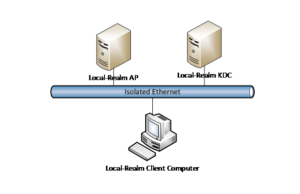

Single Realm Environment

The following table lists a suggested network configurations for all the test machines:

| &#32;| &#32;| &#32;| &#32;| &#32; |
| -------------| -------------| -------------| -------------| ------------- |
| Machine Name| Role| IPv4| Subnet Mask| DNS Server| 
| DC01| Local-Realm KDC| 192.168.0.1| 255.255.255.0| 127.0.0.1| 
| AP01| Local-Realm AP| 192.168.0.2| 255.255.255.0| 192.168.0.1| 
| CLIENT01| Local-Realm Client| 192.168.0.3| 255.255.255.0| 192.168.0.1| 

### <a name="_Toc426622600"/>Cross-Forest Trust Environment

The forest-trust environment requires interactions between the following computers and server roles: 

* The driver computer runs the test cases by capturing messages among all other computers on the wire.

* The Local-Realm KDC, Local-Realm AP, Local-Realm Client, Trust-Realm KDC, and Trust-Realm AP run the implementation of the protocols that are being tested. 

The following figure shows a forest-trust environment using an isolated Ethernet connection. 

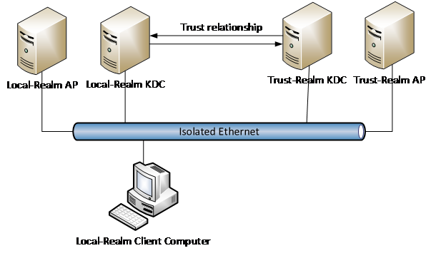

Multiple Realm Environment 

The following table lists a suggested network configurations for all the test machines:

| &#32;| &#32;| &#32;| &#32;| &#32; |
| -------------| -------------| -------------| -------------| ------------- |
| Machine Name| Role| IPv4| Subnet Mask| DNS Server| 
| DC01| Local-Realm KDC| 192.168.0.1| 255.255.255.0| 127.0.0.1; 192.168.0.10| 
| AP01| Local-Realm AP| 192.168.0.2| 255.255.255.0| 192.168.0.1| 
| CLIENT01| Local-Realm Client| 192.168.0.3| 255.255.255.0| 192.168.0.1| 
| DC02| Trust-Realm KDC| 192.168.0.10| 255.255.255.0| 127.0.0.1;| 
| | | | | 192.168.0.1| 
| AP02| Trust-Realm AP| 192.168.0.11| 255.255.255.0| 192.168.0.10| 

### <a name="_Toc426622601"/>Verify Connectivity

After you install the environment, verify the connection from the driver computer to the KDC Computers, and among all other computers in the test environment. The following provides a general list of steps you can use to check for connectivity between two Windows-based computers. For further information, see the administration guide for your operating system.

To check the connection from a Windows-based computer

Note 

* Disable active firewalls in the test environment.

* Press Win Key + R. 

* In the **Run** dialog box, type **cmd** and then click **OK**.

* At the command prompt, type **ping** followed by the IP address of the KDC computers or the other computers in the test environment and then press **Enter**. The following example checks the connection to a KDC computer with IP address 192.168.0.1:
 &#62;  ping 192.168.0.1

* If the KDC is named “DC01”, type **ping** followed by the hostname and press **Enter**:
 &#62;  ping DC01

* Repeat to confirm connectivity between all computers in the test environment.

Note 

>Verifying connection using hostname is a must because Kerberos client requires a DNS service for locating KDCs. 

Do not proceed with the installation of the test suite until connectivity is confirmed. Any issues with network connectivity must be resolved before you configure the test suite.

## <a name="_Toc426622602"/>Computer Setup

This section explains how to set up the test computers and configure the network for the test environment.

### <a name="_Toc426622603"/>Set Up the Local /Trust-Realm KDC
This section provides information about how to set up the Windows-based Local-Realm/Trust-Realm KDC Computer for use with this test suite.

To set up a Windows-based Local /Trust-Realm KDC computer:

* Run the MS-AZOD-TestSuite-ODEP.msi installer on the Windows-based Local-Realm/Trust-Realm KDC.

* When options are prompted, select the option, **Install and configure Windows System Under Test (SUT)**.

To set up a KDC that is not based on the Windows operating system, see [Configuring a KDC Computer that is Not Windows-based](#z3e851c98bb1f412da82c849d3ce30dd1).

### <a name="_Toc426622604"/>Set Up the Local /Trust-Realm AP
This section provides information about how to set up a Windows-based Local-Realm/Trust-Realm Application Server Computer for use with this test suite.

To set up a Windows-based Local /Trust-Realm AP:

* Run the MS-AZOD-TestSuite-ODEP.msi installer on the Windows-based Local-Realm/Trust-Realm Application Server Computer.

* When options are prompted, select the option, **Install and configure Windows System under Test (SUT)**.

To set up an Application Server that is not based on the Windows operating system, see [Configuring an Application Server Computer that is Not Windows-based](#_Configuring_an_Application).

### <a name="_Toc426622605"/>Set Up the Client Computer
This section provides information about how to set up the Windows-based Client Computer for use with this test suite.

Important 

To set up the driver computer:

* Install Microsoft Visual Studio, Protocol Test Framework and Microsoft Message Analyzer.

* Copy the MS-AZOD-TestSuite-ODEP.msi to the driver computer.

* Run the MS-AZOD-TestSuite-ODEP.msi file.

* When options are prompted, select the option, **Install Test Suite on Driver Computer**.

### <a name="_Toc426622606"/>Installed Files and Folders

The installation process for this test suite adds the following folders and files to the driver computer at C:\MicrosoftProtocolTests\MS-AZOD\OD-Endpoint\ &#60; _version &#35;  &#62;_ \.

Note 

The path may vary based on your installation location.
The  &#60; version &#35;  &#62;  placeholder indicates the installed build of the test suite.

|  **File or Folder**|  **Description**| 
| -------------| ------------- |
| Batch| Command files that you can use to run all test cases or, BVT test cases.| 
| Bin| Test suite binaries and configuration files.| 
| Docs| **[MS-AZOD].pdf -** Protocol specification used to develop this test suite.| 
| | **MS-AZOD_ODUserGuide.docx** – A user guide that explains how to install and configure the client computer, the Key Distribution Centers (KDC) and the Application Servers (AP), as well as how to run test cases.| 
| | **MS-AZOD_ODTestDesignSpecification.docx** – An overview document containing conceptual information about a protocol including probable use, relationships to other protocols, message flow, state diagrams, a short list of properties, and a test approach describing justification and adapter approach.| 
| | Note | 
| | The driver computer should include Microsoft Office or other programs that can open and display these documents. If it does not, you can copy these documents to a computer equipped with applications that can.| 
| Scripts| Scripts that are used to set up and configure the client computer, the Key Distribution Centers and the Application Servers.| 
| Source| Test suite source code.| 
| EULA.rtf| The End User License Agreement.| 

## <a name="_Toc426622607"/>Configuration

This section explains how to configure the network and computers in the test environment for this test suite.

This section explains how to configure the test environment for computers running Windows-based operating systems. For general information about configuring the test environment for computers that are not based on Windows, see [Configuring Computers that are Not Based on Windows.](#_Configuring_Computers_that)

### <a name="_Toc426622608"/> Configure the Local-Realm KDC 

This section provides a general list of steps that you can use to configure the Local-Realm KDC computer in a Windows-based test environment. For specific information about how to complete these steps, see the administration guide for your operating system.

To configure the Local-Realm KDC

* Log on the Local-Realm KDC computer as local administrator. 

* Configure the Computer IP and Computer Name values as section [Network Setup](#_Setup).

* Turn off firewall.

* Start Windows® PowerShell by right-clicking on the **Windows PowerShell** icon, and then click **Run as Administrator**, or from a Windows PowerShell command window, type:
_Start-process powershell -verb runAs_

* At the command prompt, type _Set-ExecutionPolicy Unrestricted -F_, and press **Enter**.

* Type _cd C:\MicrosoftProtocolTests\MS-AZOD\OD-Endpoint\_ &#60; version &#35;  &#62; _\Scripts,_ and press **Enter**.

* Type _.\ Config-DC01.ps1_ and press **Enter**.

* The script will promote the computer as domain controller, create required users, groups, Claim types, Resource property, Central access rule and central access policies to the local realm KDC computer.

### <a name="_Toc426622609"/>Configure the Local-Realm AP 

This section provides a general list of steps that you can use to configure the Local-Realm Application Server computer in a Windows-based test environment. For specific information about how to complete these steps, see the administration guide for your operating system.

To configure the Local-Realm Application Server computer

* Verify that the Local-Realm KDC Computer is configured and running.

* Log on to the Local-Realm Application Server computer as local administrator.

* Turn off firewall.

* Configure the Computer IP and Computer Name values as section [Network Setup](#_Setup).

* Type _cd C:\MicrosoftProtocolTests\ MS-AZOD\OD-Endpoint\_ &#60; version &#35;  &#62; _\Scripts,_ and press **Enter**.

* Type _.\Config-AP01.ps1_, and press **Enter**.

* The script will join the application server into local realm, create share folders to local realm application server, and apply resource property and central access policy to these folders.

### <a name="_Toc426622610"/>Configure the Trust-Realm KDC 

Note 

Trust realm KDC is not required for Single realm environment. If you only run single realm cases, please skip this step.

This section provides a general list of steps that you can use to configure the Trust-Realm KDC computer in a Windows-based test environment. For specific information about how to complete these steps, see the administration guide for your operating system.

To configure the Trust-Realm KDC

* Log on the Trust-Realm KDC computer as local administrator. 

* Turn off firewall.

* Configure the Computer IP and Computer Name values as section [Network Setup](#_Setup).

* Type _cd C:\MicrosoftProtocolTests\ MS-AZOD\OD-Endpoint\_ &#60; version &#35;  &#62; _\Scripts,_ and press **Enter**.

* Type _.\Config-DC02.ps1_, and press **Enter**.

* The computer will promote itself as domain controller, restart automatically, then setup the forest trust with local realm, then define claims, central access rules and central access policy.

### <a name="_Toc426622611"/>Configure the Trust-Realm AP

Note 

Trust realm KDC is not required for Single realm environment. If you only run single realm cases, please skip this step.
This section provides a general list of steps that you can use to configure the Trust-Realm Application Server computer in a Windows-based test environment. For specific information about how to complete these steps, see the administration guide for your operating system.

To configure the Trust-Realm Application Server computer

* Verify that the Trust-Realm KDC Computer is configured and running.

* Log on to the Trust-Realm Application Server computer as local administrator.

* Turn off firewall.

* Configure the Computer IP and Computer Name values as section [Network Setup](#_Setup).

* Type cd _C:\MicrosoftProtocolTests\ MS-AZOD\OD-Endpoint\_ &#60; version &#35;  &#62; _\Scripts,_ and press **Enter**.

* Type _.\Config-AP02.ps1,_ and press **Enter**.

* The script will join the application server in to trust realm, create share folder and apply central access policy to the share folder.

### <a name="_Toc426622612"/>Configure the Client Computer 

This section provides a general list of steps that you can use to configure the driver computer in a Windows-based test environment. For specific information about how to complete these steps, see the administration guide for your operating system.

To configure the client computer

* Log on to the client computer as local Administrator.

* Turn off firewall.

* Configure the Computer IP and Computer Name values as section [Network Setup](#_Setup).

* Type _cd C:\MicrosoftProtocolTests\ MS-AZOD\OD-Endpoint\_ &#60; version &#35;  &#62; _\Scripts,_ and press **Enter**.

* Type _.\Config-client01.ps1_, and press **Enter**.

* The script will create logging folders and join the client computer into local realm.

## <a name="_Toc426622613"/>Configuring the Test Suite

This test suite is installed with default configuration settings. You may need to change these settings if you use a customized test environment or if you customize your test runs. 

You can define various required and optional settings for the test suite, such as the following:

* Define the settings of the test environment, including computer names and IP addresses.

* Define the basic options used in the test suite; for example, the protocol version or the version of the target operating system.

* Define the folders used to store output and logs from test runs.

* Define the location of scripts to run before each test run.

* Set time limits on discrete test tasks and for test runs.

To change configuration settings for this suite, edit the MS-AZOD_ODTestSuite.deployment.ptfconfig file. You can find this file in the directory C:\MicrosoftProtocolTests\MS-AZOD\OD-Endpoint\ &#60; version &#35;  &#62; \Bin.

### <a name="_Toc426622614"/>Required Configuration Settings

The following table describes the required configuration properties and their values. 

| &#32;| &#32; |
| -------------| ------------- |
|  **Property**|  **Description**| 
|  **ApplicationServerName**| The default application server name in local realm.| 
| | Default value: **AP01**| 
|  **ApplicationServerIP**| The default application server IP in local realm.| 
| | Default value: 192.168.0.2| 
|  **FQDNUncPath**| The default application server share folder name in local realm.| 
| | Default value: **\\AP01.contoso.com\azodshare**| 
|  **UncPath**| The default application server share folder name in local realm.| 
| | Default value: **\\192.168.0.2\azodshare**| 
|  **KdcDomainName**| The default local realm domain name.| 
| | Default value: **contoso.com**| 
|  **KdcName**| The default DC computer name in local realm.| 
| | Default value: **DC01**| 
|  **KDCIP**| The default DC IP in local realm.| 
| | Default value: **192.168.0.1**| 
|  **KdcAdminUser**| The default domain administrator user name in local realm.| 
| | Default value: **administrator**| 
|  **KdcAdminPwd**| The default domain administrator user password in local realm.| 
| | Default value: **Password01!**| 
|  **KdcClaimUser**| The default user name with claim in local realm.| 
| | Default value: **claimuser**| 
|  **KdcClaimUserPwd**| The default user password with claim in local realm.| 
| | Default value: **Password01!**| 
|  **ClientComputerName**| The default client computer name in local realm.| 
| | Default value: **client01**| 
|  **ClientComputerIp**| The default client computer IP in local realm.| 
| | Default value: **192.168.0.3**| 
|  **ClientAdminUser**| The default client computer administrator user name in local realm.| 
| | Default value: **administrator**| 
|  **ClientAdminPwd**| The default client computer administrator password in local realm.| 
| | Default value: **Password01!**| 
|  **CrossForestName**| The default forest name of cross realm.| 
| | Default value: **kerb.com**| 
|  **CrossForestDCName**| The default DC computer name in cross realm.| 
| | Default value: **DC02**| 
|  **CrossForestDCIP**| The default DC computer IP in cross realm.| 
| | Default value: **192.168.0.10**| 
|  **CrossForestAdminUser**| The default domain administrator user name in cross realm.| 
| | Default value: **administrator**| 
|  **CrossForestAdminPwd**| The default domain administrator user password in cross realm.| 
| | Default value: **Password01!**| 
|  **CrossForestApplicationServerName**| The default application server name in cross realm.| 
| | Default value: **AP02**| 
|  **CrossForestApplicationServerIP**| The default application server IP in cross realm.| 
| | Default value: **192.168.0.11**| 
|  **CrossForestApplicationServerShareFolder**| The default application server share folder in cross realm.| 
| | Default value: **\\AP02.kerb.com\azodshare**| 
|  **ScriptPath**| The default scripts path in test suite installation directory for all endpoints.| 
| | Default value: **C:\MicrosoftProtocolTests\MS-AZOD\OD-Endpoint\ &#60; version &#35;  &#62; \Scripts.**| 
| | Note | 
| | The default version number is 1.0.5644.0, which may inconsistent with the current version number. Please update the  &#60; version &#35;  &#62;  as the actual version number installed on the driver computer.| 
|  **LocalCapFilePath**| The default directory for Message Analyzer capture files on driver computer.| 
| | Default value: **C:\Test\TestLog\MA**| 
|  **DriverLogPath**| The default log directory on driver computer.| 
| | Default value: **C:\Test\TestLog**| 
|  **MaxSMB2DialectSupported**| Max SMB2 Dialect supported.| 
| | Default value: **770**| 
|  **SiteName**| The default Name of the Site.| 
| | Default value: **Default-First-Site-Name**| 
|  **CentralAccessPolicyNames**| The default central access policy name.| 
| | Default value: **AZODPolicy**| 
|  **CentralAccessRuleNames**| The default central access rule.| 
| | Default value: **AZODRule**| 
|  **ResourcepropertyNames**| The default Resource property name.| 
| | Default value: **Company_Name**| 

### <a name="_Toc426622615"/>Optional Configuration Settings

No optional configuration settings. 

## <a name="_Toc426622616"/>Running Test Cases

This test suite includes command files that you can use to complete basic test cases. Each test case exercises the protocol implementation based on a given scenario. 

You can find and run these test cases in the following directory: 
C:\MicrosoftProtocolTests\MS-AZOD\OD-Endpoint\ _&#60; version &#35;  &#62;_ \Batch

You can run these command files at the command prompt, or by selecting and clicking one or more of the files from the directory.

### <a name="_Toc426622617"/>Run All Test Cases

Use the steps below to run all test cases. Shortcuts listed are created during the installation process.

To run all test cases

* From the desktop of the driver computer, double-click the **Run MS-AZOD-OD-EP Test Cases** shortcut. 
Alternatively, go to C:\MicrosoftProtocolTests\MS-AZOD\OD-Endpoint\ _&#60; version &#35;  &#62;_ \Batch and double-click the **RunAllTestCases.cmd** file. 

### <a name="_Toc426622618"/>Run Specified Test Cases

Use the steps below to run specific test cases.

To run specified test cases

* Refer to the section [Debugging Test Cases](#_Debugging_Test_Cases).

### <a name="_Toc426622619"/>Check Test Results

Test suite generates test result files in different paths based on the way how test case is executed.

For running test case with batch: C:\MicrosoftProtocolTests\MS-AZOD\OD-Endpoint\ _&#60; version &#35;  &#62;_ \Batch\TestResults

For running test case with Visual Studio: C:\MicrosoftProtocolTests\MS-AZOD\OD-Endpoint\ _&#60; version &#35;  &#62;_ \Source\OD\TestCode\TestResults

For further information about test log settings, see the PTF User Guide in the PTF installation directory.

## <a name="_Toc426622620"/>Debugging Test Cases

You can use the Visual Studio solution file (.sln) included with this test suite to debug additional test cases that you create for your protocol implementation. 

Note 

Copy MS-AZOD_ODTestSuite.deployment.ptfconfig file from the C:\MicrosoftProtocolTests\MS-AZOD\OD-Endpoint\ &#60; version &#35;  &#62; \Bin folder to C:\MicrosoftProtocolTests\MS-AZOD\OD-Endpoint\ &#60; version &#35;  &#62; \Source\Server\TestSuite and replace the original files.

To debug a test case

* On the driver computer, use Visual Studio to open the following solution file:

* C:\MicrosoftProtocolTests\MS-AZOD\OD-Endpoint\ _&#60; version &#35;  &#62;_ \Source\Server\TestCode\MS-AZOD_OD.sln

* In Visual Studio, Open Test explorer window.

* In Visual Studio, in the Solution Explorer window, right-click the ‘**MS-AZOD_OD’** solution, and select **Build Solution**.

* Select the cases listed in the Test explorer window and run or debug cases.

## <a name="_Toc426622621"/>Troubleshooting

This section describes how to troubleshoot common issues in running test cases.

### <a name="_Toc426622622"/>Ping Failure

| &#32;| &#32; |
| -------------| ------------- |
| PROBLEM| The domain controller does not respond to pings from the driver computer.| 
| CAUSE| Check the firewall is turned off for each computer | 
| RESOLUTION| Disable the firewall for all endpoints| 

### <a name="_Toc426622623"/>Test Run Issues

| &#32;| &#32; |
| -------------| ------------- |
| PROBLEM| 8 test cases failed with error cannot find the capture| 
| CAUSE| The 8 cases are for the observer scenarios, which depend on the network capture for verification against TD message sequences.| 
| | If the capture files don’t exist, the case will fail.| 
| RESOLUTION| Capture the data on the wire by MMA and save the capture files to folder **LocalCapFilePath** specified and the case will go on. If the case still failed, it means the capture file doesn’t match the expected frames or miss some messages. This depends on the capture file quality.| 

| &#32;| &#32; |
| -------------| ------------- |
| PROBLEM| The test suite is not running as expected| 
| CAUSE| The .ptfconfig file was not found or the configuration property values were not set.| 
| RESOLUTION| Copy the .ptfconfig file to the path C:\MicrosoftProtocolTests\MS-AZOD\OD-Endpoint\ &#60; version &#35;  &#62; \Server\TestCode\TestSuite and verify the values in the file.| 

## <a name="_Toc426622624"/>Appendix: Build the Cross-realm Trust Relationship between Windows AD and MIT KDC

### <a name="_Toc426622625"/>Overview
This document is prepared for the installation of Windows AD and MIT KDC, and the guide for building the cross-realm trust relationship between AD and KDC. Moreover, extra descriptions will be given.
The configurations are tuned to adapt the Winterop Protocol testing environment, and are NOT meant to be applied to any production environments. In the rest of the document, I will assume machines in the following table to have machine names, domain/realm etc. Make necessary adjustment if any machine/domain/realm differs in your own test environment.

| &#32;| &#32;| &#32;| &#32;| &#32;| &#32; |
| -------------| -------------| -------------| -------------| -------------| ------------- |
| Machine| Machine Name| Domain/Realm| Role| Build| IP Address| 
| Windows AD| DC01| MS.KERB| DC| Windows Server 2012| 172.16.0.1/2012::1| 
| MIT KDC| kdc| MIT.KERB| KDC| Fedora17/Krb5-1.10| 172.16.0.254/2012::254| 
| Win Client| win8| MS.KERB| Client| Windows 8| 172.16.0.101/2012::101| 
| Linux Client| client| MIT.KERB| Client| Fedora17| 172.16.0.201/2012::201| 

### <a name="_Toc426622626"/>Configuring the MIT KDC

#### <a name="_Toc426622627"/>Install Fedora 17

* In order to compatible with Hyper-V, a Fedora-17-KDE version is recommended. Also, you SHOULD select the proper Time Zone such as Shanghai etc.  and UNCHECK System clock uses UTC. Configure a “Legacy Network Adapter” to your VM and make sure it’s connected to the External Network.

**

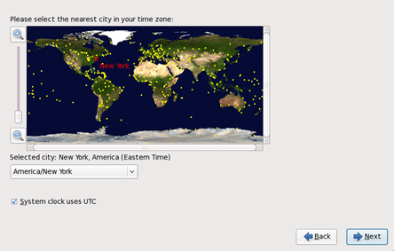
**

* Disable the Linux Desktop GUI(KDE) from System Boot (logon as root, the same below).

* Disable the NetworkManager to enable IPV4 Address.

* Disable the iptables. In order to support IPv6, you must disable the ip6tables.

#### <a name="_Toc426622628"/>Install MIT KDC

* Install the necessary packages in the Master KDC. Before this, you MUST configure the proper yum repository and http proxy (An example of 163 mirrors is below). . Append the following to /etc/profile:

Here jpnproxy.fareast.corp.microsoft.com is used in Shanghai site. Please replace the server with your site’s preferred proxy server. 

* Then, you can begin install the MIT KDC.

* Change the network to your own environment, since the MIT KDC will run in this internal network. Edit /etc/sysconfig/network-scripts/ifcfg-eth0 to this:

* Configure the DNS name server and restart network. Edit /etc/resolv.conf to this:

* Also, you must specify the host name if you didn’t before. Edit /etc/sysconfig/network to this:

* Specify the hosts file. Edit /etc/hosts to this:

* Follow up instructions on [http://web.mit.edu/Kerberos/krb5-current/doc/krb_admins/install_kdc.html &#35; edit-kdc-configuration-files](http://web.mit.edu/Kerberos/krb5-current/doc/krb_admins/install_kdc.html). An example of /etc/krb5.conf is below. 

An example of /var/kerberos/krb5kdc/kdc.conf is below.

* Create the KDC database on the MIT KDC realm.

This will create five files in /var/kerberos/krb5kdc (or at the locations specified in kdc.conf):
●two Kerberos database files, principal, and principal.ok
●the Kerberos administrative database file, principal.kadm5
●the administrative database lock file, principal.kadm5.lock
●the stash file, in this example .k5.MIT.KERB. If you do not want a stash file, run the above command without the -s option.

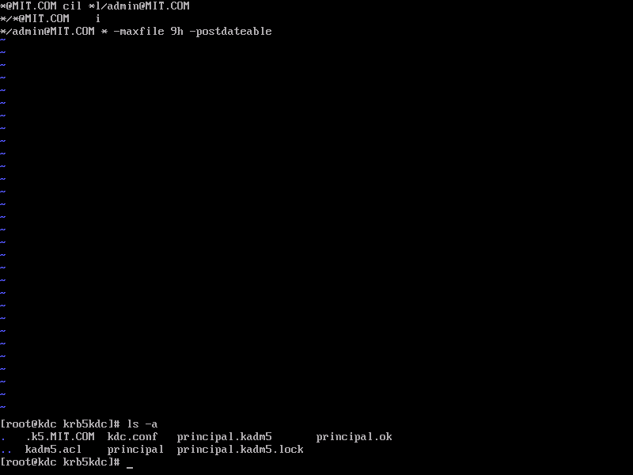

* Add administrators to the Access Control List (ACL) file. You need create an ACL file and put the Kerberos principal of at least one of the administrators into it. This file is used by the kadmind daemon to control which principals may view and make privileged modifications to the Kerberos database files. The ACL filename is determined by the acl_file variable in kdc.conf; the default is /var/kerberos/krb5kdc/kadm5.acl. Here is an example of a kadm5.acl.

* Add administrators to the Kerberos database. For example, admin/admin.

* Create a new user account in the MIT KDC as a test User, such as [mituser@MIT.KERB](mailto:mituser@mit.kerb). Also, you had better add the pre-authentication attribute to this user.

* Start the Kerberos daemons on the MIT KDC. You can verify that they started properly by checking for their startup messages in the logging locations you defined in krb5.conf (see [logging]).Any errors the daemons encounter while starting will also be listed in the logging output.

* As an additional verification, check if kinit succeeds against the principals that you have created on the previous step.

### <a name="_Toc426622629"/>Configuring the Windows DNS and AD

#### <a name="_Toc426622630"/>Install DNS Server
Install Windows DNS.
Run dnsmgmt.msc
Right Click Forward Lookup Zones- &#62; New Zone… (use default settings)
Name the New Zone with the realm name of the MIT KDC. 
Navigate to DNSDC01Forward Lookup ZonesKERB
Right click KERB and create New Domain for MIT.KERB. Then, create SRV for Kerberos service, Kpasswd service and Host (A) for the KDC host. For example in MIT.KERB, (1) create _kerberos._udp.MIT.KERB and _kerberos._tcp.MIT.KERB on port 88 offered by host kdc.mit.kerb; (2) create _kpasswd._udp.MIT.KERB and _kpasswd._tcp.MIT.KERB on port 464 offered by host kdc.mit.kerb; (3) create IPv4 and IPv6 address-to-host resolution for kdc.mit.kerb.
For any machine joining MIT.KERB realms: For example Client joining MIT.KERB, (1) create IPv4 and IPv6 address-to-host resolution for client.mit.kerb.

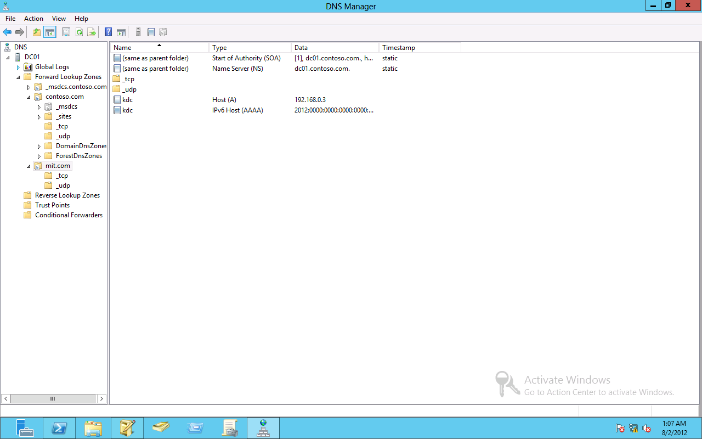

#### <a name="_Toc426622631"/>Install Windows AD
Install Windows AD with domain MS.KERB.
Create a new user account in the Active Directory as a test user, such as msuser.

To avoid dispensable troubles, you had better open the 88 port or close the firewall.

### <a name="_Toc426622632"/>Setting Trust between Windows AD and MIT KDC

#### <a name="_Toc426622633"/>Configure the Windows AD

* Set up access to services. Workstation computers that use services in an MIT realm need to have a realm entry added and enable delegation across the realm trust. To do this, use the Ksetup command on Windows AD that uses the MIT realm for services.

* Start the Active Directory Domains and Trusts snap-in, Right-click on **Properties** of your domain (MS.KERB), then select the **Trusts** tab and select **New Trust**.

* Create a trusted domain relationship with the MIT Kerberos realm using the following parameters:

* Trust Name:  &#60; MIT.KERB &#62; 

* Trust Type: Realm trust

* Transitivity of Trust: Transitive 

* Direction of Trust: Two-way

* Trust Password:  &#60; provide the password you created for the MIT Kerberos realm, this password will be mentioned in the next section &#62; 

* The sequence of these steps is shown in the following screenshots:

* 

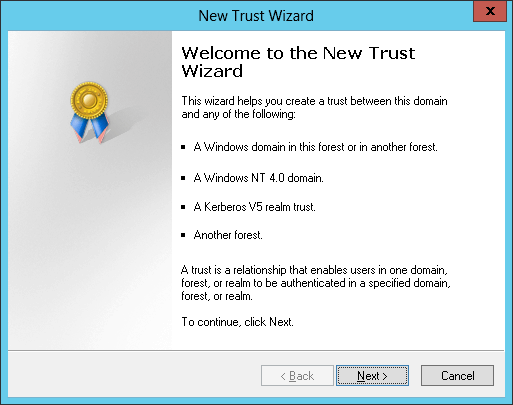

* 

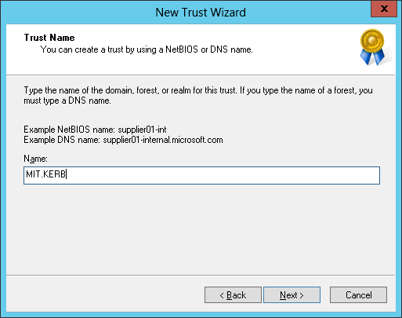

* 

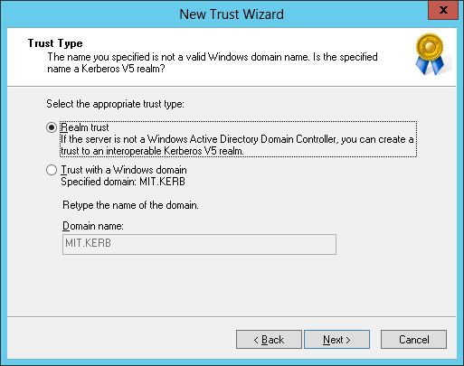

* 

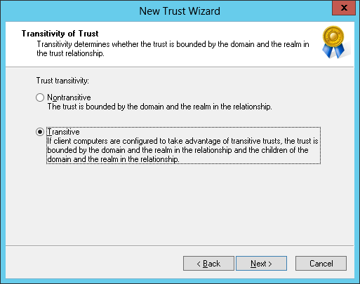

* 

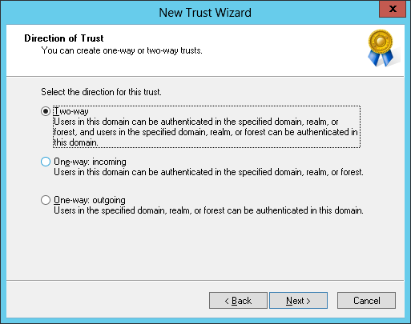

* 

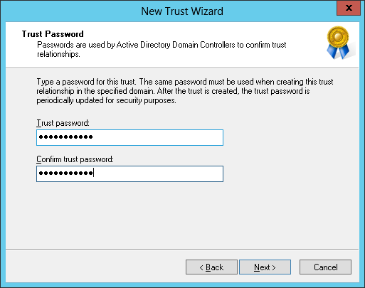

* 

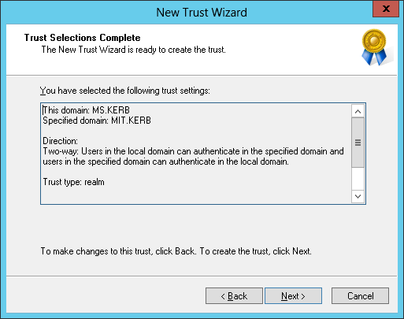

* 

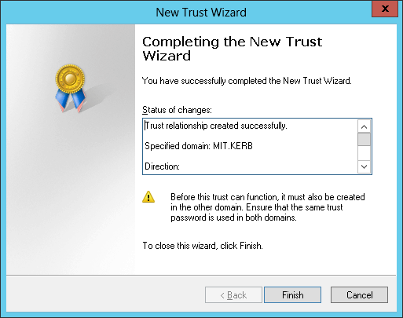

* 

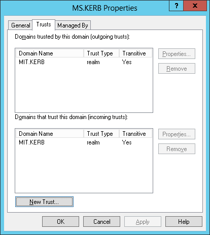

#### <a name="_Toc426622634"/>Configure the MIT KDC

* Use the following MIT Kerberos administration commands to create cross-realm principals in the foreign MIT realm (note that the commands is typically run on MIT KDC).

* After executing each of these commands you will be prompted to supply a password for the account. This password should match the password supplied when creating the Cross-Realm trust in the Active Directory Domains and Trusts snap-in as performed previously in section 4.1.

* To be careful, there may be some clock problems because of the different time between DC and KDC. You should sync the time, for example, let Windows AD as the Time Server(NTP). Run this command in the MIT KDC to sync.

#### <a name="_Toc426622635"/>Create account mappings

* Account mappings are used to map a foreign Kerberos identity (in a trusted non-Windows Kerberos realm) to a local account identity in the domain. These account mappings are managed through the Active Directory Users and Computers snap-in.

* These account mappings will allow the non-Windows Kerberos realm to act as an account domain. Users with non-Windows Kerberos principals that have mappings to domain accounts, can logon to a workstation that is joined to a trusted domain using the non-Windows Kerberos principal and password from the non-Windows Kerberos realm.

* Start the Active Directory Users and Computers snap-in, start advanced features by clicking View, and then Advanced Features as shown below.

* 

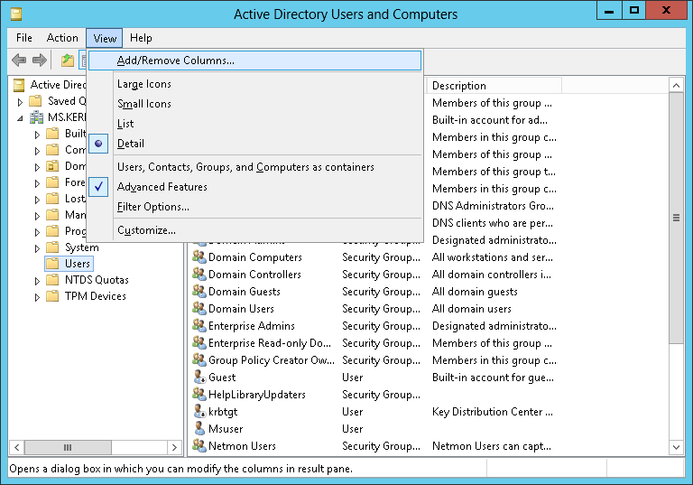

* Locate the account to which you want to create mappings, and right-click to view **Name** **Mappings**. This example uses the account msuser.

* 

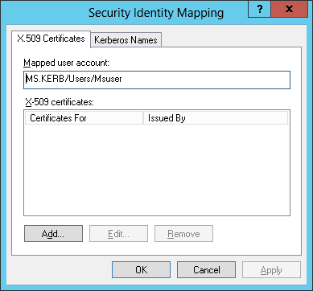

* Click the **Kerberos Names** mappings tab, add a principal from the foreign MIT realm. The example shown below uses [mituser@MIT.KERB](mailto:mituser@mit.kerb).

* 

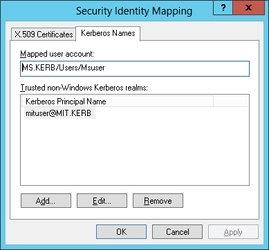

#### <a name="_Toc426622636"/>Verify the cross-realm trust relationship
There are some features to show the cross-realm trust relationship has been built before. Also, you can install the clients, such as Windows 8 client and Fedora client, to join each realm as a member of realm user. You can run your own services such as File Sharing or Web Service in the client that has joined one of this realms, and logon from the client of other realm using the other realm’s users. But I just show the relationship’s features and left the other testes to yourself.
First, if the cross-realm trust relationship has been built, there must be some users in the Active Directory. Open the **ADSI Edit**, move to **CN=Users**, you can find **CN=krbtgt** and **CN=MIT.KERB$** as below.

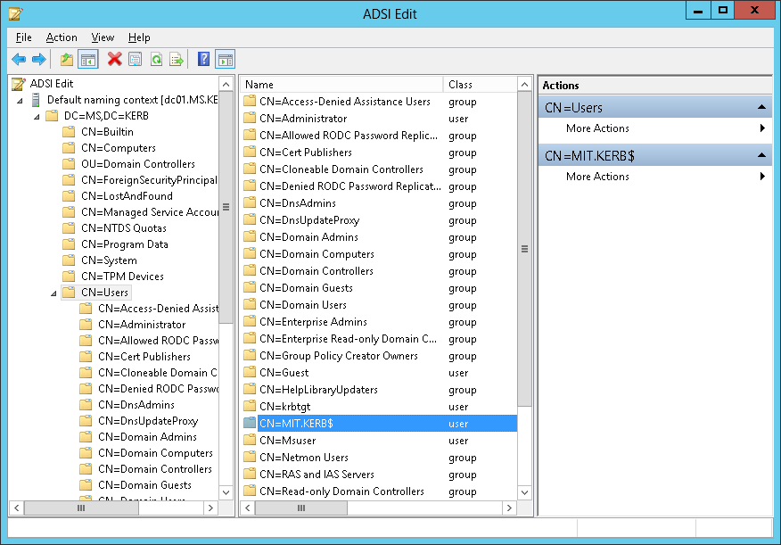

Move to **CN=System**, you can find trustedDomain **CN=MIT.KERB**.

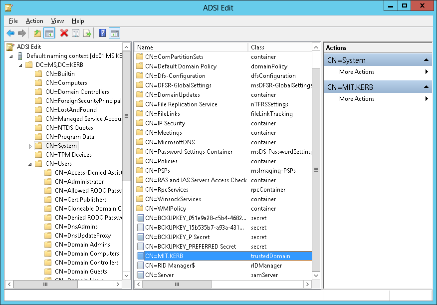

On the other hand, there must be some users in the MIT KDC as the red circle show below.

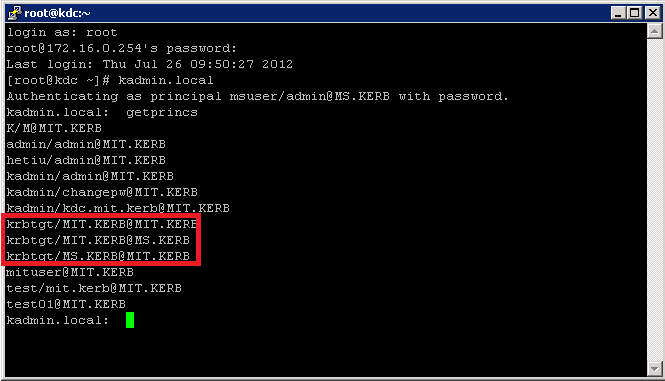

Of course, the verifications show above cannot be absolutely valid. You must try your own test case to verify the trusting relationship such as Samba. I will not give it in this document.

## <a name="_Toc426622637"/>Reference
[Kerberos V5 Installation Guide.](http://web.mit.edu/Kerberos/krb5-current/doc/krb_admins/install.html)
[Kerberos V5 System Administrator's Guide.](http://web.mit.edu/kerberos/krb5-1.10/krb5-1.10.2/doc/krb5-admin.html) 
[Kerberos Interoperability Step-by-Step Guide for Windows Server 2003.](http://social.technet.microsoft.com/wiki/contents/articles/2751.kerberos-interoperability-step-by-step-guide-for-windows-server-2003-en-us.aspx)

